

    

    Universidad Peruana de Ciencias Aplicadas

    Carrera de Ingeniería de Software 

      
    <h3>1ASI0730</h3>
   <h3>Aplicaciones Web</h3> 
    NRC
   <h3>12263 </h3> 
   <h3>Informe del Trabajo Final</h3> 
    Docente
    <h3>Castro Veramendi, Rafael Oswaldo</h3>
    Equipo
  <h3>HomeMatch</h3>
       
    Proyecto
    <h3>InCleanHome</h3>
     

  

    <h3>Integrantes</h3>

<table>
  <tr>
    <th align="left">Código</th>
    <th align="left">Apellidos y Nombres</th>
  </tr>
  <tr>
    <td>u202317450</td>
    <td>Choy Robles, Vanessa May Lang</td>
  </tr>
  <tr>
    <td>u202411567</td>
    <td>Espino Rossi, Victor Manuel</td>
  </tr>
  <tr>
    <td>u202415618</td>
    <td>Garcia Cerpa, Braden Raid</td>
  </tr>
  <tr>
    <td>u20231a816</td>
    <td>Valverde Portuguez, Natalia Ximena</td>
  </tr>
  <tr>
    <td>u202411622</td>
    <td>Vara Velásquez, Oscar Fernando</td>
  </tr>
</table>

     
<h3 align="center"> Período 202610 </h3>
     
<h3 align="center"> Julio 2026 </h3>

## Registro de Versiones del Informe

### Registro de Versiones del Informe

**Tabla 1:** *Registro histórico de versiones del documento.*

| Versión | Fecha | Autor(es) | Descripción de modificación |
| :--- | :--- | :--- | :--- |
| 0.1 | 10/04/2026 | Valverde, Natalia | Creación del repositorio. Adición de Startup & Solution Profile, Antecedentes, Problemática, Lean UX y Segmentos Objetivos. |
| 0.2 | 12/04/2026 | Choy, Vanessa | Incorporación de Análisis Competitivo, Diseño y Análisis de Entrevistas, y artefactos de Needfinding (User Personas, Task Matrix, Journey Mapping y Empathy Mapping). |
| 0.3 | 14/04/2026 | Choy, Vanessa; Valverde, Natalia | Redacción colaborativa de User Stories, Impact Mapping y estructuración del Product Backlog inicial; adición de Ubiquitous Language. |
| 0.4 | 16/04/2026 | Espino, Victor | Diseño de Style Guidelines, Information Architecture y bases del Software Object-Oriented Design (Class Diagrams). |
| 0.5 | 18/04/2026 | Garcia, Braden | Incorporación de Wireframes y Mockups tanto para la Landing Page como para la Web Application. |
| 0.6 | 20/04/2026 | Vara, Oscar | Adición de Domain-Driven Design (EventStorming), Software Configuration Management y despliegue inicial de la Landing Page. |
| 0.7 | 22/04/2026 | Equipo Completo | Revisión de consistencia, validación de Student Outcomes y cierre de la documentación para la entrega TB1. |
| 0.8 | 05/05/2026 | Choy, Vanessa | Configuración base del proyecto en Vue 3 con Vite. Implementación del sistema de internacionalización (i18n) y creación del módulo `Shared`. |
| 0.9 | 08/05/2026 | Valverde, Natalia; Garcia, Braden | Implementación del módulo `User-Management` (Auth y Persistence) y desarrollo del catálogo de servicios en `Search-and-catalog`. |
| 1.0 | 10/05/2026 | Vara, Oscar; Espino, Victor | Desarrollo del módulo de `Booking` para gestión de reservas e integración del módulo de `Reviews & Evaluation`. |
| 1.1 | 12/05/2026 | Choy, Vanessa | Integración del módulo de `Payments`. Configuración de **JSON Server** para persistencia local (`db.json`) y resolución de conflictos de rutas. |
| 1.2 | 13/05/2026 | Equipo Completo | **Merge final de ramas por módulos**. Pruebas de integración E2E, validación de estilos globales y cierre de documentación para el **Trabajo Parcial**. |
| 1.3 | 28/05/2026 | Equipo Completo | **Reestructuración Arquitectónica**: Migración y rediseño del backend. Se eliminó la simulación local de JSON Server y **se crearon nuevos y más Bounded Contexts** para el negocio (`IAM`, `Profiles`, `Booking`, `SearchAndCatalog`, `Payments`, `ReviewsAndEvaluation` y `Messaging`). |
| 1.4 | 10/06/2026 | Equipo Completo | **Edición y Ajustes del Frontend**: Modificación integral de las interfaces en Vue 3 para adaptarlas, estructurarlas y conectarlas con el consumo de los nuevos Bounded Contexts del backend. |
| 1.5 | 18/06/2026 | Equipo Completo | **Desarrollo del Backend y Despliegue General**:  • Implementación de la lógica de negocio distribuida por Bounded Contexts:   - *Booking*: Garcia, Braden.   - *IAM* y *Profiles*: Choy, Vanessa.   - *SearchAndCatalog*: Vara, Oscar.   - *Payments* y *ReviewsAndEvaluation*: Espino, Victor.   - *Messaging*: Valverde, Natalia. • **Despliegues en la Nube**:   - Despliegue del Frontend (Web Application).   - Despliegue del Backend de microservicios.   - Despliegue y migración de la Base de Datos relacional de producción. |
---

## Project Report Collaboration Insights  

### Project Report Collaboration Insights

#### **TB1**
Todas las actividades asignadas para la entrega de la TB1 han sido completadas satisfactoriamente. El equipo **HomeMatch** utilizó un flujo de trabajo basado en GitHub para centralizar la documentación en formato Markdown, asegurando la trazabilidad de cada aporte y el control de versiones.

La colaboración se distribuyó de manera equitativa: **Natalia Valverde** estableció los cimientos del negocio y Lean UX; **Vanessa Choy** lideró la investigación de campo, el análisis de usuarios y la especificación de requerimientos; **Victor Espino** y **Braden Garcia** definieron la experiencia visual y arquitectura de información; mientras que **Oscar Vara** gestionó la arquitectura técnica, configuración y el despliegue.

#### **Evidencias de Colaboración (GitHub Insights)**

**Insights - Contributors**

  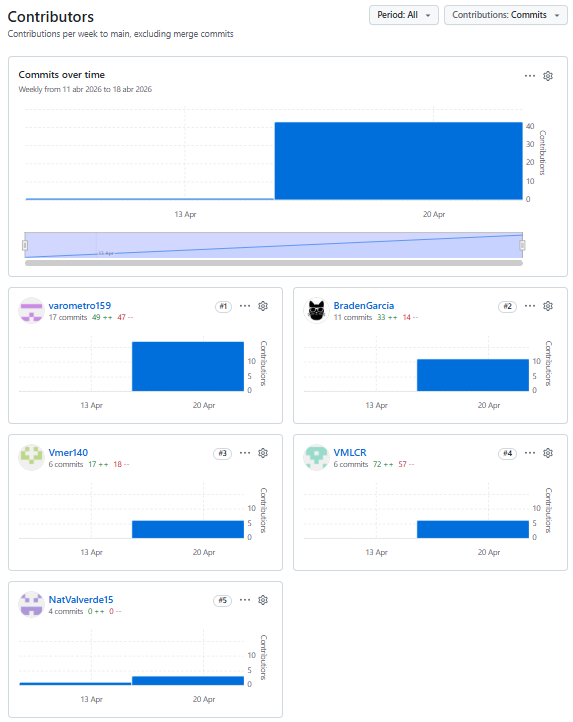

**Network Graph**

  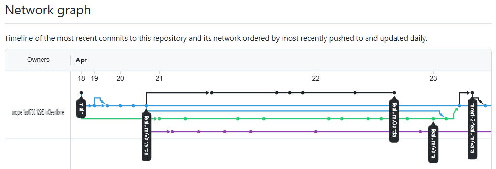

  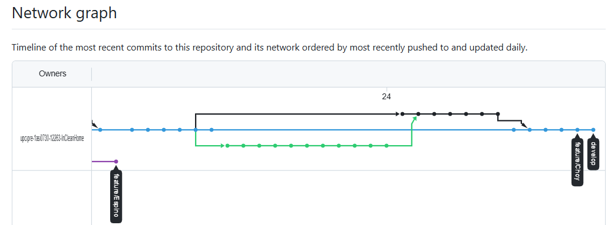

#### **Trabajo Parcial (TP)**
Se consolidó la primera versión funcional de la aplicación web utilizando Vue 3 y Vite, integrando internacionalización (i18n) y simulando la persistencia de datos localmente mediante JSON Server. El equipo realizó un *merge* final de ramas por módulos, validando la consistencia de estilos y garantizando el correcto flujo de las rutas principales antes del cierre de la documentación.

#### **TB2**
Todas las actividades planificadas para la entrega de la TB2 han sido completadas con éxito. En esta etapa, el equipo migró la arquitectura inicial basada en simulación local hacia un ecosistema de producción real. Se rediseñó el backend eliminando el JSON Server y **se crearon nuevos y más Bounded Contexts** para segmentar limpiamente la lógica de negocio, lo que requirió una edición integral y el refinamiento de la interfaz del Frontend en Vue 3 para consumir estos nuevos endpoints API.

La colaboración y el desarrollo técnico se distribuyeron por responsabilidades específicas de la siguiente manera:
* **Vanessa Choy:** Lideró el diseño y desarrollo de los Bounded Contexts de **IAM** (Identity and Access Management) y **Profiles**.
* **Braden Garcia:** Estuvo a cargo de la implementación del Bounded Context de **Booking** para la gestión de reservas.
* **Oscar Vara:** Desarrolló el Bounded Context de **SearchAndCatalog** para el catálogo y búsqueda de servicios.
* **Victor Espino:** Se encargó del desarrollo de los Bounded Contexts de **Payments** y **ReviewsAndEvaluation**.
* **Natalia Valverde:** Implementó el Bounded Context de **Messaging** para la comunicación interna de la plataforma.

Finalmente, el equipo trabajó de forma conjunta en el **Despliegue General**, logrando poner en producción el entorno Frontend (Web Application), los servicios del Backend y la base de datos relacional en la nube.

#### **Evidencias de Colaboración (GitHub Insights - TB2)**

**Insights - Contributors**

  

**Network Graph**

  

El repositorio del proyecto se encuentra disponible en el siguiente enlace:
[https://github.com/upc-pre-1asi0730-12263-InCleanHome](https://github.com/upc-pre-1asi0730-12263-InCleanHome)

---

# Tabla de Contenidos

- Capítulo I: Introducción
  - [1.1 Startup Profile](#11-startup-profile)
    - [1.1.1 Descripción de la Startup](#111-descripcion-de-la-startup)
    - [1.1.2 Perfiles de Integrantes del Equipo](#112-perfiles-de-integrantes-del-equipo)
  - [1.2 Solution Profile](#12-solution-profile)
    - [1.2.1 Antecedentes y Problemática](#121-antecedentes-y-problematica)
    - [1.2.2 Lean UX Process](#122-lean-ux-process)
      - [1.2.2.1 Lean UX Problem Statements](#1221-lean-ux-problem-statements)
      - [1.2.2.2 Lean UX Assumptions](#1222-lean-ux-assumptions)
      - [1.2.2.3 Lean UX Hypothesis Statements](#1223-lean-ux-hypothesis-statements)
      - [1.2.2.4 Lean UX Canvas](#1224-lean-ux-canvas)
  - [1.3 Segmentos Objetivos](#13-segmentos-objetivos)

- Capítulo II: Requirements Elicitation & Analysis
  - [2.1 Competidores](#21-competidores)
    - [2.1.1 Análisis competitivo](#211-analisis-competitivo)
    - [2.1.2 Estrategias y tácticas frente a competidores](#212-estrategias-y-tacticas-frente-a-competidores)
  - [2.2 Entrevistas](#22-entrevistas)
    - [2.2.1 Diseño de entrevistas](#221-diseno-de-entrevistas)
    - [2.2.2 Registro de entrevistas](#222-registro-de-entrevistas)
    - [2.2.3 Análisis de entrevistas](#223-analisis-de-entrevistas)
  - [2.3 Needfinding](#23-needfinding)
    - [2.3.1 User Personas](#231-user-personas)
    - [2.3.2 User Task Matrix](#232-user-task-matrix)
    - [2.3.3 User Journey Mapping](#233-user-journey-mapping)
    - [2.3.4 Empathy Mapping](#234-empathy-mapping)
  - [2.4 Big Picture EventStorming](#24-big-picture-eventstorming)
  - [2.5 Ubiquitous Language](#25-ubiquitous-language)

- Capítulo III: Requirements Specification
  - [3.1 User Stories](#32-user-stories)
  - [3.2 Impact Mapping](#33-impact-mapping)
  - [3.3 Product Backlog](#34-product-backlog)

- Capítulo IV: Product Design
  - [4.1 Style Guidelines](#41-style-guidelines)
    - [4.1.1 General Style Guidelines](#411-general-style-guidelines)
    - [4.1.2 Web Style Guidelines](#412-web-style-guidelines)
  - [4.2 Information Architecture](#42-information-architecture)
    - [4.2.1 Organization Systems](#421-organization-systems)
    - [4.2.2 Labeling Systems](#422-labeling-systems)
    - [4.2.3 SEO Tags and Meta Tags](#423-seo-tags-and-meta-tags)
    - [4.2.4 Searching Systems](#424-searching-systems)
    - [4.2.5 Navigation Systems](#425-navigation-systems)
  - [4.3 Landing Page UI Design](#43-landing-page-ui-design)
    - [4.3.1 Landing Page Wireframe](#431-landing-page-wireframe)
    - [4.3.2 Landing Page Mock-up](#432-landing-page-mock-up)
  - [4.4 Web Applications UX/UI Design](#44-web-applications-uxui-design)
    - [4.4.1 Web Applications Wireframes](#441-web-applications-wireframes)
    - [4.4.2 Web Applications Wireflow Diagrams](#442-web-applications-wireflow-diagrams)
    - [4.4.3 Web Applications Mock-ups](#443-web-applications-mock-ups)
    - [4.4.4 Web Applications User Flow Diagrams](#444-web-applications-user-flow-diagrams)
  - [4.5 Web Applications Prototyping](#45-web-applications-prototyping)
  - [4.6 Domain-Driven Software Architecture](#46-domain-driven-software-architecture)
    - [4.6.1 Software Architecture Context Diagrams](#461-software-architecture-context-diagrams)
    - [4.6.2 Software Architecture Container Diagrams](#462-software-architecture-container-diagrams)
    - [4.6.3 Software Architecture Components Diagrams](#463-software-architecture-components-diagrams)
  - [4.7 Software Object-Oriented Design](#47-software-object-oriented-design)
    - [4.7.1 Class Diagrams](#471-class-diagrams)
    - [4.7.2 Class Dictionary](#472-class-dictionary)
  - [4.8 Database Design](#48-database-design)
    - [4.8.1 Database Diagram](#481-database-diagram)

- Capítulo V: Product Implementation, Validation & Deployment
  - [5.1 Software Configuration Management](#51-software-configuration-management)
    - [5.1.1 Software Development Environment Configuration](#511-software-development-environment-configuration)
    - [5.1.2 Source Code Management](#512-source-code-management)
    - [5.1.3 Source Code Style Guide & Conventions](#513-source-code-style-guide--conventions)
    - [5.1.4 Software Deployment Configuration](#514-software-deployment-configuration)
  - [5.2 Landing Page, Services & Applications Implementation](#52-landing-page-services-applications-implementation)
    - [5.2.1 Sprint 1](#521-sprint-1)
      - [5.2.1.1 Sprint Planning 1](#5211-sprint-planning-1)
      - [5.2.1.2 Aspect Leaders and Collaborators](#5212-aspect-leaders-and-collaborators)
      - [5.2.1.3 Sprint Backlog 1](#5213-sprint-backlog-1)
      - [5.2.1.4 Development Evidence for Sprint Review](#5214-development-evidence-for-sprint-review)
      - [5.2.1.5 Execution Evidence for Sprint Review](#5215-execution-evidence-for-sprint-review)
      - [5.2.1.6 Services Documentation Evidence for Sprint Review](#5216-services-documentation-evidence-for-sprint-review)
      - [5.2.1.7 Software Deployment Evidence for Sprint Review](#5217-software-deployment-evidence-for-sprint-review)
      - [5.2.1.8 Team Collaboration Insights during Sprint](#5218-team-collaboration-insights-during-sprint)
      
  - [6. Conclusiones](#conclusiones)
  - [7. Bibliografía](#bibliografia)
  - [8. Anexos](#anexos)

## Índice de Tablas

- [Tabla 1: Registro histórico de versiones del documento](#tabla-1)
- [Tabla 2: Sustento de acciones y conclusiones para el Student Outcome 5](#tabla-2)
- [Tabla 3: Matriz de análisis competitivo: InCleanHome frente a sus principales competidores](#tabla-3)
- [Tabla 4: Ficha técnica de la Entrevista 1 (Eduardo Chacarías)](#tabla-4)
- [Tabla 5: Ficha técnica de la Entrevista 2 (Elvira Vara Velásquez)](#tabla-5)
- [Tabla 6: Ficha técnica de la Entrevista 3 (Gianella Hermoza)](#tabla-6)
- [Tabla 7: Ficha técnica de la Entrevista 4 (Lupe D.)](#tabla-7)
- [Tabla 8: Ficha técnica de la Entrevista 5 (Rosa Chavez)](#tabla-8)
- [Tabla 9: Ficha técnica de la Entrevista 6 (Romina Hermoza)](#tabla-9)
- [Tabla 10: Matriz de tareas de usuario (User Task Matrix) comparativa entre Clientes y Trabajadoras](#tabla-10)
- [Tabla 11: Especificación detallada de Epics y User Stories con criterios de aceptación](#tabla-11)
- [Tabla 12: Product Backlog priorizado con estimación de Story Points](#tabla-12)
- [Tabla 13: Tokens de diseño y valores hexadecimales de la paleta cromática](#tabla-13)
- [Tabla 14: Configuración de Breakpoints para el diseño responsivo](#tabla-14)
- [Tabla 15: Estructura del sistema de etiquetado (Labeling System)](#tabla-15)
- [Tabla 16: Configuración de filtros del sistema de búsqueda principal](#tabla-16)
- [Tabla 17: Resumen ejecutivo del Sprint Planning 1](#tabla-17)
- [Tabla 18: Asignación de roles y responsabilidades en el repositorio para el Sprint 1](#tabla-18)
- [Tabla 19: Sprint Backlog detallado para el Sprint 1](#tabla-19)
- [Tabla 20: Desglose de tareas técnicas: US-L08](#tabla-20)
- [Tabla 21: Desglose de tareas técnicas: US-L09](#tabla-21)
- [Tabla 22: Desglose de tareas técnicas: US-L07](#tabla-22)
- [Tabla 23: Desglose de tareas técnicas: US-L10](#tabla-23)
- [Tabla 24: Desglose de tareas técnicas: EP-01 (Gestión de usuarios)](#tabla-24)
- [Tabla 25: Desglose de tareas técnicas: EP-02 (Búsqueda y filtrado)](#tabla-25)
- [Tabla 26: Desglose de tareas técnicas: EP-03 (Perfiles y reseñas)](#tabla-26)
- [Tabla 27: Desglose de tareas técnicas: EP-04 (Contratación y pagos)](#tabla-27)
- [Tabla 28: Desglose de tareas técnicas: EP-05 (Comunicación y notificaciones)](#tabla-28)
- [Tabla 29: Desglose de tareas técnicas: EP-06 (Gestión de disponibilidad)](#tabla-29)
- [Tabla 30: Estado final de las User Stories del Sprint 1](#tabla-30)
- [Tabla 31: Resumen ejecutivo del Sprint Planning 2](#tabla-31)
- [Tabla 32: Asignación de roles y responsabilidades en el repositorio para el Sprint 2](#tabla-32)
- [Tabla 33: Sprint Backlog detallado para el Sprint 2](#tabla-33)
- [Tabla 34: Registro de commits y evidencia de integración continua (CI) en GitHub](#tabla-34)

**ABET – EAC - Student Outcome 5**

La capacidad de funcionar efectivamente en un
equipo cuyos miembros juntos proporcionan liderazgo, crean un entorno de
colaboración e inclusivo, establecen objetivos, planifican tareas y cumplen objetivos. 
En el siguiente cuadro se describe las acciones realizadas y enunciados de conclusiones por parte del grupo,
que permiten sustentar el haber alcanzado el logro del ABET – EAC - Student Outcome 5.

**Tabla 2:** *Sustento de acciones y conclusiones para el Student Outcome 5.*

| Criterio específico | Acciones Realizadas | Conclusiones |
|---------------------|-----------------------------|--------------|
| **Trabaja en equipo para proporcionar liderazgo en forma conjunta** | **Choy Robles, Vanessa May Lang** **TB1:** Lideró la transición del análisis de entrevistas hacia la especificación técnica de requerimientos, asegurando que el Product Backlog y las User Stories reflejaran fielmente las necesidades detectadas en el Needfinding. **TP1:** Lideró la estandarización de la arquitectura frontend mediante la creación del módulo Shared e implementó el sistema de internacionalización (i18n) para asegurar la escalabilidad del proyecto. Además, coordinó la integración de los flujos de Payments con el resto de módulos. **TB2:** Lideró la transición arquitectónica hacia el backend real, asumiendo la dirección, diseño y desarrollo de los Bounded Contexts críticos de **IAM** y **Profiles**.  **Espino Rossi, Victor Manuel** **TB1:** Co-lideró las sesiones de diseño de guías de estilos y la definición inicial de la arquitectura de información para sentar las bases visuales del reporte. **TP1:** Se encargó de la especificación y desarrollo del módulo Reviews & Evaluation, definiendo las métricas de feedback necesarias para el sistema de confianza de la plataforma. **TB2:** Asumió el coliderazgo técnico en la implementación del backend, desarrollando de manera íntegra los Bounded Contexts de **Payments** y **ReviewsAndEvaluation**.  **Garcia Cerpa, Braden Raid** **TB1:** Dirigió el diseño de wireframes y maquetación de Mockups tanto para la Landing Page como para la aplicación web principal. **TP1:** Dirigió el desarrollo técnico del módulo Search-and-catalog, asegurando que los criterios de filtrado y búsqueda de profesionales fueran coherentes con los requerimientos funcionales del negocio. **TB2:** Lideró la reestructuración del flujo transaccional principal de la plataforma mediante el desarrollo del Bounded Context de **Booking** para la gestión de reservas.  **Valverde Portuguez, Natalia Ximena** **TB1:** Dirigió la fase inicial de alineación estratégica, definiendo la misión, visión y el Lean UX Canvas, proporcionando el marco conceptual necesario para que el resto del equipo desarrollara las especificaciones técnicas. **TP1:** Lideró el diseño e implementación del módulo User-Management, definiendo las entidades de usuario y la lógica de autenticación que sirve de base para el control de acceso en todos los demás módulos. **TB2:** Guió el desarrollo de la capa de comunicación síncrona/asíncrona de la aplicación a través de la codificación y despliegue del Bounded Context de **Messaging**.  **Vara Velásquez, Oscar Fernando** **TB1:** Lideró la gestión de la configuración de software, el modelado inicial a través de EventStorming y el despliegue de la Landing Page del proyecto. **TP1:** Lideró la lógica del módulo Booking, estableciendo los flujos de reserva y estados del servicio, garantizando la trazabilidad entre el cliente y la trabajadora. **TB2:** Comandó el diseño del catálogo unificado de servicios mediante la programación del Bounded Context de **SearchAndCatalog** y supervisó la integración del despliegue general en la nube. | El equipo consolidó un liderazgo colaborativo de ingeniería basado en la descentralización por componentes transaccionales. Al evolucionar hacia una arquitectura basada estrictamente en **Bounded Contexts**, la asignación de responsables individuales por contexto no solo aceleró el desarrollo independiente del backend, sino que facilitó una integración cohesiva con la edición de interfaces del frontend, asegurando un producto robusto y escalable para la entrega final de la TB2. |
| **Crea un entorno colaborativo e inclusivo, establece metas, planifica tareas y cumple objetivos** | **Choy Robles, Vanessa May Lang** **TB1:** Estableció hitos críticos para la entrega de los Capítulos II y III, coordinando con los integrantes la validación del Big Picture EventStorming y el Impact Mapping para garantizar un diseño de solución coherente. **TP1:** Estableció la configuración base de Vite y los estándares de código en el repositorio compartido. Planificó la integración del sistema de pagos asegurando que cumpliera con los hitos de funcionalidad del Trabajo Parcial. **TB2:** Planificó el cronograma de refactorización para la Web Application en Vue 3 y coordinó la integración de los servicios de IAM y perfiles con los componentes compartidos del frontend.  **Espino Rossi, Victor Manuel** **TB1:** Gestionó de manera inclusiva el cumplimiento de metas asociadas al diseño técnico orientado a objetos, promoviendo el debate abierto de diagramas de clases. **TP1:** Aportó al entorno colaborativo mediante la documentación y el testeo de los componentes de reseña, asegurando la calidad de los datos presentados en el perfil de la trabajadora. **TB2:** Estableció y cumplió las metas de persistencia para las transacciones de pago e historial de evaluaciones, integrando con éxito su base de datos relacional al flujo del negocio.  **Garcia Cerpa, Braden Raid** **TB1:** Fomentó la colaboración técnica mediante la sincronización continua en reuniones virtuales de desarrollo para la consistencia de las interfaces de usuario. **TP1:** Cumplió con los objetivos de visualización del catálogo, participando activamente en la resolución de conflictos de combinación (merge) de ramas en GitHub. **TB2:** Modificó y adaptó los componentes visuales del frontend en Vue 3 para vincularlos con la lógica de negocio real del backend de reservas (`Booking`).  **Valverde Portuguez, Natalia Ximena** **TB1:** Planificó las tareas de investigación de antecedentes y segmentación de objetivos (Capítulo I), facilitando un entorno inclusivo al integrar los perfiles de todos los miembros y definir el problema central de manera compartida. **TP1:** Planificó las tareas de gestión de perfiles, integrando validaciones que permiten un entorno inclusivo para distintos roles de usuario (cliente y trabajadora). **TB2:** Cumplió con las metas del sprint programando los endpoints del servicio de mensajería y participando activamente en las pruebas cruzadas (E2E) de integración de API.  **Vara Velásquez, Oscar Fernando** **TB1:** Aseguró un ambiente de alta responsabilidad mediante el seguimiento riguroso de los plazos de entrega de artefactos arquitectónicos en GitHub. **TP1:** Ejecutó la planificación de las tareas relacionadas con el flujo de reservaciones, cumpliendo con los plazos de entrega del sprint correspondientes al Trabajo Parcial. **TB2:** Planificó, automatizó y ejecutó el **Despliegue General** de la solución en la nube, garantizando la correcta interconexión operativa entre el Frontend, el Backend distribuido y la Base de Datos de producción. | El éxito en el cumplimiento de los objetivos de la TB2 se fundamentó en una cultura de desarrollo ágil y un flujo de CI/CD ordenado. El equipo demostró adaptabilidad al planificar la eliminación total de la persistencia simulada e instaurar entornos reales en la nube. La inclusión se vio reflejada en la resolución conjunta de conflictos en Git y en una validación integral que permitió desplegar de forma armonizada el frontend, backend y base de datos. |

## Capítulo I: Introducción

### 1.1. Startup Profile-

#### 1.1.1. Descripción de la Startup
HomeMatch ofrece una solución innovadora con el aplicativo "InCleanHome" en la búsqueda de la trabajadora del hogar ideal para el hogar de los clientes según las necesidades específicas que requiere el cliente del personal a contratar. Mediante una interfaz intuitiva y con buena usabilidad, los clientes pueden buscar y elegir su empleado ideal a través de filtros que facilitan su búsqueda como por ejemplo, distritos donde laboran, tipo de casa que limpian, si realizan servicio de cocina, limpieza, jardín, edad, género,etc. Además, en la aplicación puedes revisar comentarios o reviews de otros clientes que han hecho uso del servicio de una persona en específico.
InCleanHome sería una aplicación gratuita y tendría una ganancia al cobrar un 10% de cada servicio realizado.
El objetivo de este proyecto es facilitar la búsqueda de un empleado del hogar a la familia con todos los requisitos que solicite y según la tarifa que este puede ofrecer, y que a su vez sea una persona segura y de confianza.

**Misión:** Brindar una plataforma digital confiable y accesible que conecte a clientes con trabajadoras del hogar verificadas, facilitando la contratación de servicios domésticos de manera segura, rápida y eficiente.

**Visión:** Ser la plataforma líder en servicios domésticos en Perú, reconocida por mejorar la calidad de vida de los usuarios y promover la formalización laboral de las trabajadoras del hogar mediante el uso de tecnología.

#### 1.1.2. Perfiles de Integrantes del Equipo

    
    
- Choy Robles, Vanessa May Lang - u202317450 (Ingeniería de Software)

Soy estudiante de Ingeniería de Software con experiencia en distintos lenguajes de programación, diseño UX/UI y trabajo bajo metodologías ágiles como Scrum. Aporto al equipo una visión orientada tanto a la funcionalidad como a la experiencia del usuario, contribuyendo en el desarrollo y mejora continua del producto. Me caracterizo por mi responsabilidad, cumplimiento de plazos y participación activa en el trabajo colaborativo. 

    

- Espino Rossi, Victor Manuel - u202411567 (Ingenieria de Software)
- Soy un estudiante de Ingenieria de Software, tengo 19 años. Cuento con sólidas habilidades para el trabajo en equipo y una gran capacidad para aprender rápido y adaptarse a nuevos retos. Comprometido con entregar resultados de calidad y siempre dispuesto a colaborar para que el equipo alcance sus objetivos.

  

    

- Garcia Cerpa, Braden Raid - u202415618 (Ingeniería de Software)
-Soy estudiante de Ingeniería de Software con interés en el desarrollo de soluciones tecnológicas. Me enfoco en aplicar buenas prácticas de programación y trabajo en equipo para resolver problemas reales. En este proyecto, busco aportar ideas innovadoras para lograr resultados de alta calidad.

    

- Valverde Portuguez, Natalia Ximena - u20231a816 (Ingeniería de Software)

Estudiante de Ingeniería de Software en la Universidad Peruana de Ciencias Aplicadas (UPC). Cuento con conocimientos de Marketing y estoy interesada en el UX Design y data analysis. Experiencia en trabajos de creación de startups en el ámbito laboral, lo que fortalece mis capacidades tanto en trabajos grupales e individuales como para las bases de un proyecto.

    

- Vara Velásquez, Oscar Fernando - u202411622 (Ingeniería de Software)-Enfocado en crear soluciones tecnológicas de acuerdo a las necesidades de los usuarios. Cuento una rápida adquisición de conocimientos y trabajo en equipo.

### 1.2. Solution Profile

#### 1.2.1. Antecedentes y problemática

En el Perú, el trabajo doméstico remunerado continúa siendo un sector altamente informal y vulnerable, especialmente en Lima Metropolitana. Según datos recientes de la Encuesta Nacional de Hogares (ENAHO) y reportes del 2026, más de 441,000 personas se dedican a labores domésticas, de las cuales aproximadamente el 95% son mujeres; sin embargo, pese a la existencia de la Ley N.º 31047 que regula sus derechos laborales, alrededor del 95% de estas trabajadoras aún se encuentra en situación de informalidad y solo un pequeño porcentaje cuenta con contrato formal, acceso a beneficios sociales o seguridad laboral . Esta realidad evidencia una problemática estructural caracterizada por la precariedad laboral, la falta de regulación efectiva y la ausencia de soluciones digitales que faciliten un proceso de contratación seguro, eficiente y transparente.

**What**  
El problema central es la dificultad para encontrar y contratar personal doméstico confiable, calificado y disponible, debido a la falta de plataformas digitales seguras que permitan validar información, comparar opciones y garantizar un proceso de contratación transparente.

**When**  
El problema se manifiesta en el momento en que los usuarios necesitan contratar servicios domésticos o cuando las trabajadoras del hogar buscan empleo, especialmente en contextos de urgencia o necesidad inmediata.

**Where**  
Esta problemática se presenta principalmente en Lima Metropolitana, donde existe una alta demanda de servicios domésticos y una gran concentración de trabajadoras del hogar, aunque también puede replicarse en otras ciudades del país.

**Who**  
La problemática involucra principalmente a dos grupos: por un lado, personas que requieren servicios domésticos, como familias, profesionales con poco tiempo y adultos mayores; y por otro lado, trabajadoras del hogar que buscan oportunidades laborales estables y seguras, muchas de las cuales se encuentran en condiciones de informalidad.

**Why**  
Esta situación ocurre debido a la falta de digitalización del sector, la informalidad predominante, la ausencia de mecanismos de verificación de identidad y experiencia, y la limitada implementación de normativas laborales que protejan a las trabajadoras.

**How**  
Actualmente, el proceso de contratación se realiza mediante recomendaciones, redes sociales o contactos personales, lo que implica entrevistas manuales y decisiones basadas en información incompleta, generando riesgos, pérdida de tiempo y baja confianza.

**How much**  
La problemática tiene un alto impacto, ya que implica pérdida de tiempo en la búsqueda, inseguridad en la contratación, baja calidad del servicio en algunos casos y una alta tasa de informalidad laboral que afecta tanto a empleadores como a trabajadoras del hogar.

#### 1.2.2. Lean UX Process

##### 1.2.2.1. Lean UX Problem Statements

Actualmente, en Lima Metropolitana, muchas personas que necesitan servicios domésticos enfrentan dificultades para encontrar personal confiable, disponible y verificado. La mayoría de procesos se realiza de manera informal mediante recomendaciones, redes sociales o contactos personales, lo que genera incertidumbre, pérdida de tiempo y riesgos en la contratación.
Asimismo, las trabajadoras del hogar enfrentan limitadas oportunidades laborales formales, ya que no cuentan con una plataforma centralizada que les permita mostrar sus habilidades, experiencia y disponibilidad de manera confiable.
Hemos observado que no existe una herramienta digital especializada que conecte de forma segura a clientes con trabajadoras del hogar, permitiendo filtrar perfiles, validar información, revisar reseñas y realizar contrataciones con garantía.

**¿Cómo podríamos facilitar que los usuarios encuentren y contraten personal doméstico confiable, verificado y disponible de manera rápida y segura, al mismo tiempo que se generan más oportunidades laborales para las trabajadoras del hogar?**

**¿QUIÉN ES EL USUARIO?**
Nuestros usuarios son personas que necesitan servicios domésticos, como familias, profesionales con poco tiempo o adultos mayores. También incluye a trabajadoras del hogar que buscan oportunidades laborales seguras y estables.

**¿DÓNDE ENCAJA NUESTRO PRODUCTO EN SU VIDA?**
El producto se integra en la vida diaria de los usuarios como una herramienta digital que facilita la contratación de servicios domésticos de forma rápida. Puede ser utilizado en momentos de necesidad inmediata o como parte de la organización semanal del hogar.

**¿QUÉ PROBLEMAS TIENE NUESTRO PRODUCTO Y CÓMO SE PUEDE RESOLVER?**
Los usuarios enfrentan procesos informales, falta de confianza y dificultad para encontrar personal adecuado. Las trabajadoras, por su parte, tienen acceso limitado a oportunidades formales.

Para resolverlo, la plataforma permitirá a los usuarios buscar perfiles verificados, aplicar filtros, revisar reseñas y contratar servicios de forma segura. Las trabajadoras podrán crear perfiles, gestionar su disponibilidad y acceder a más clientes.

**¿CUÁNDO Y CÓMO ES USADO NUESTRO PRODUCTO?**
La plataforma es utilizada cuando los usuarios necesitan contratar servicios domésticos, ya sea de forma urgente o planificada. También puede ser usada de manera recurrente para agendar servicios periódicos y gestionar tareas del hogar.

**¿QUÉ CARACTERÍSTICAS SON IMPORTANTES?**
- Filtros de búsqueda personalizados
- Perfiles verificados
- Sistema de reseñas
- Pagos digitales seguros
- Mensajería interna
- Gestión de disponibilidad

**¿CÓMO DEBE VERSE Y COMPORTARSE EL PRODUCTO?**
El producto debe ser intuitivo, seguro y fácil de usar. Visualmente debe transmitir confianza y profesionalismo. Su comportamiento debe ser rápido, confiable y enfocado en brindar una experiencia fluida tanto para clientes como trabajadoras.

##### 1.2.2.2. Lean UX Assumptions

**Business Assumptions**
- Creemos que la dificultad para encontrar personal doméstico confiable es un problema frecuente en Lima Metropolitana.
- Creemos que los usuarios estarán dispuestos a pagar por servicios domésticos a través de una plataforma digital segura.
- Creemos que existe una demanda creciente de servicios domésticos debido al estilo de vida ocupado de los usuarios.
- Creemos que una solución tecnológica permitirá formalizar y mejorar las condiciones laborales de las trabajadoras del hogar.

**Business Outcomes**
- Creemos que al implementar una plataforma digital para la contratación de servicios domésticos, podremos aumentar la cantidad de servicios contratados en un 30%.
- Creemos que al incluir perfiles verificados y reseñas, incrementaremos la confianza de los usuarios en un 40%.
- Creemos que al ofrecer pagos digitales seguros, aumentaremos la tasa de transacciones completadas en un 25%.
- Creemos que al facilitar la conexión directa entre clientes y trabajadoras, reduciremos el tiempo de contratación en un 35%.

**User Assumptions**
- Creemos que los usuarios necesitan una forma rápida y confiable de encontrar personal doméstico.
- Creemos que los clientes valoran la seguridad y la verificación de perfiles antes de contratar.
- Creemos que las trabajadoras del hogar buscan mayor estabilidad laboral y acceso a más oportunidades.
- Creemos que los usuarios prefieren soluciones digitales simples y fáciles de usar.
- Creemos que la posibilidad de ver reseñas influye en la decisión de contratación.

**User Outcomes**
- Creemos que al ofrecer filtros de búsqueda personalizados, los usuarios podrán encontrar servicios más rápido y de forma eficiente.
- Creemos que al implementar perfiles verificados, los clientes se sentirán más seguros al contratar.
- Creemos que al incluir un sistema de reseñas, los usuarios podrán tomar decisiones más informadas.
- Creemos que al ofrecer pagos digitales, los usuarios podrán realizar transacciones de manera rápida y segura.
- Creemos que al permitir la gestión de disponibilidad, las trabajadoras podrán organizar mejor su tiempo y aumentar sus oportunidades laborales.

**Feature Assumptions**
- Creemos que un sistema de búsqueda con filtros (ubicación, habilidades, disponibilidad) mejorará la experiencia del usuario.
- Creemos que los perfiles verificados con documentos aumentarán la confianza en la plataforma.
- Creemos que la mensajería interna facilitará la coordinación entre cliente y trabajadora.
- Creemos que el sistema de pagos digitales reducirá el riesgo y facilitará la contratación.
- Creemos que el sistema de verificación de trabajadoras garantizará mayor seguridad y calidad del servicio.

##### 1.2.2.3. Lean UX Hypothesis Statements

1. **Creemos que** implementando perfiles verificados con reseñas y calificaciones, los usuarios podrán confiar más en el proceso de contratación y tomar decisiones informadas.

**Sabremos que** tendremos éxito cuando:
Se incremente en un 20% la tasa de contratación y aumente en un 25% la interacción con los perfiles dentro de la plataforma en los primeros 3 meses.

2. **Creemos que** al incluir filtros personalizados (ubicación, habilidades y disponibilidad), los usuarios podrán encontrar más rápido el servicio que necesitan.

**Sabremos que** tendremos éxito cuando:
Se reduzca en un 30% el tiempo promedio de búsqueda y aumente en un 20% la cantidad de servicios contratados.

3. **Creemos que** al implementar un sistema de pagos digitales seguros, los usuarios se sentirán más confiados al realizar transacciones dentro de la aplicación.

**Sabremos que** tendremos éxito cuando:
Se incremente en un 25% el número de pagos realizados dentro de la plataforma y disminuyan en un 15% las cancelaciones de servicios.

##### 1.2.2.4. Lean UX Canvas

**Imagen 1:** *Lean UX Canvas*

  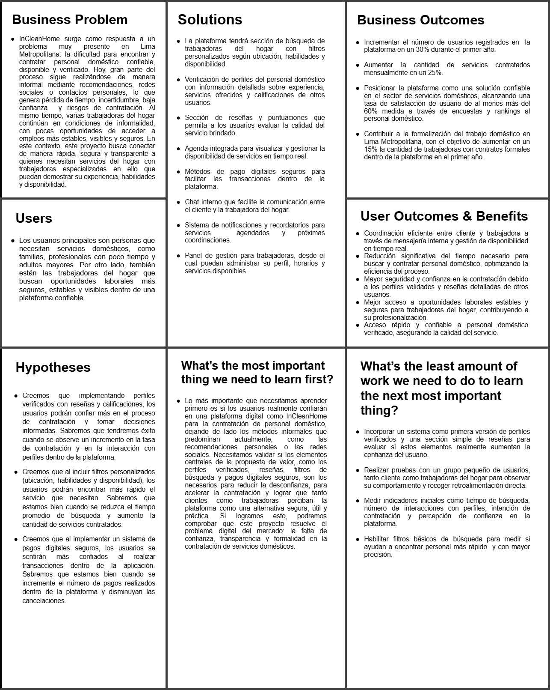

### 1.3. Segmentos Objetivos

### Segmento Objetivo 1: 
**Clientes (Usuarios que demandan servicios domésticos)**
Este segmento está conformado por personas que requieren apoyo en tareas del hogar, incluyendo profesionales, familias con niños y adultos mayores que necesitan asistencia frecuente.

**Características demográficas:**
- Edad: entre 25 y 65 años
- Ubicación: Lima Metropolitana
- Nivel socioeconómico: medio y medio-alto
- Ocupación: profesionales, trabajadores dependientes, independientes, familias y adultos mayores
- Nivel educativo: técnico o universitario

**Características conductuales:**
- Tienen poco tiempo para realizar labores domésticas o requieren apoyo constante.
- Buscan servicios confiables, seguros y de calidad.
- Valoran reseñas, calificaciones y verificación de perfiles.
- Utilizan aplicaciones móviles o prefieren soluciones simples y accesibles.
- En el caso de adultos mayores o familias con niños, priorizan confianza y continuidad del servicio.

**Sustento estadístico:**

Según el Instituto Nacional de Estadística e Informática (INEI), una gran proporción de la población en Lima se encuentra laboralmente activa, lo que incrementa la necesidad de externalizar tareas del hogar. Además, el crecimiento de la población adulta mayor en el Perú ha generado una mayor demanda de servicios de apoyo doméstico y cuidado personal.

### Segmento Objetivo 2: 
**Trabajadoras del hogar (Oferta de servicios)**

Este segmento está compuesto por personas que brindan servicios domésticos y buscan oportunidades laborales más estables y formales.

**Características demográficas:**
- Edad: entre 20 y 60 años
- Ubicación: Lima Metropolitana y zonas periféricas
- Nivel socioeconómico: bajo y medio
- Nivel educativo: primaria o secundaria completa

**Características conductuales:**
- Buscan empleo constante y mejores ingresos
- Tienen experiencia en limpieza, cocina y cuidado del hogar
- Muchas trabajan en condiciones informales
- Están interesadas en acceder a más oportunidades laborales y mejorar su estabilidad

**Sustento estadístico:**
De acuerdo con el Ministerio de Trabajo y Promoción del Empleo, en el Perú existen más de 400,000 trabajadoras del hogar, de las cuales la mayoría se encuentra en situación de informalidad, lo que evidencia la necesidad de soluciones que promuevan su formalización laboral.

## Capítulo II: Requirements Elicitation & Analysis

### 2.1. Competidores

#### 2.1.1. Análisis competitivo

**Tabla 3:** *Matriz de análisis competitivo: InCleanHome frente a sus principales competidores.*

| **Competitive Analysis Landscape** |  |  |  |  |  |
|-------------------------|--|--|--|--|--|
| ¿Por qué llevar a cabo este análisis?  | El objetivo de este análisis es identificar las fortalezas, debilidades, oportunidades y amenazas de los principales competidores en el mercado de servicios domésticos, con el fin de definir la ventaja competitiva de InCleanHome y su posicionamiento en el mercado peruano. |  |  |  |  |  |
|  |  | **InCleanHome**  | **Zolvers** 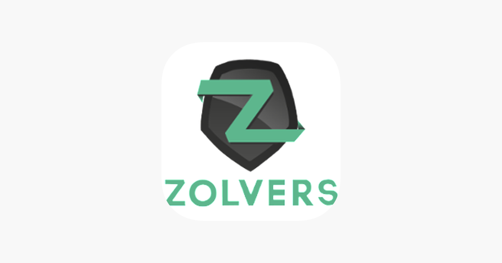 | **TuAliada**  | **Servicios Informales (Facebook, etc)**  |
| **Perfil** | Overview | Plataforma digital que conecta usuarios con trabajadoras del hogar mediante filtros avanzados y sistema de reseñas. | Plataforma digital que conecta usuarios con personal doméstico verificado en LATAM.| Empresa formal que brinda servicios de limpieza con personal contratado. | Medio informal para contactar trabajadoras del hogar sin intermediarios formales. |
| | **Ventaja competitiva** ¿Qué valor ofrece a los clientes? | Alta personalización, seguridad, filtros avanzados y adaptación al mercado peruano. | Personal verificado y sistema de reputación consolidado. | Servicio confiable con personal capacitado. | Bajo costo y fácil acceso. |
| **Perfil de marketing** |  |  |  |  |  |
| | **Mercado objetivo** | Hogares peruanos que buscan servicios domésticos confiables y personalizados. | Hogares urbanos de ingresos medios y altos en LATAM. | Hogares y oficinas en Lima que buscan servicios formales.  | Público general que busca soluciones rápidas y económicas. |
| | **Estrategias de marketing** | Marketing digital, redes sociales, enfoque en confianza y seguridad. | Publicidad digital, posicionamiento de marca y reputación online. | Branding formal, alianzas y marketing tradicional/digital. | Publicaciones en grupos y boca a boca. |
| **Perfil de Producto** |  |  |  |  |  |
| | **Productos & Servicios** | Plataforma web/móvil para contratar trabajadoras del hogar con filtros y reviews. | Plataforma digital para contratación de servicios domésticos. | Servicio de limpieza gestionado por la empresa. | Contacto directo con trabajadoras del hogar. |
| | **Precios & Costos** | Transparencia de precios, competitivos y accesibles. | Tarifas moderadas con comisión por servicio. | Costos más altos por servicio formal. | Bajos costos pero variables. |
| | **Canales de distribución** |  Canales de distribución (Web y/o Móvil) | Web y móvil | Web y móvil | Web y contacto directo | Redes sociales (Facebook, WhatsApp) |
| **Análisis SWOT** |  |  |  |  |
| | **Fortalezas** | Alta personalización, seguridad, sistema de reseñas, adaptación local. | Marca posicionada, sistema de reputación, experiencia internacional. | Servicio confiable, personal capacitado, formalidad. | Bajo costo, accesibilidad, rapidez. |
| | **Oportunidades** | Startup nueva, menor reconocimiento de marca. | No totalmente adaptado a Perú, costos relativamente altos. | Baja personalización, poca flexibilidad. | Falta de seguridad, informalidad, sin verificación. |
| | **Debilidades** | Crecimiento del mercado digital, formalización del sector, alta demanda insatisfecha. | Expansión en nuevos mercados. | Crecimiento del sector servicios en Perú. | Alta demanda en sectores informales. |
| | **Amenazas** | Competencia consolidada | Nuevas startups locales más adaptadas. | Plataformas digitales más innovadoras. | Regulación futura o desconfianza del usuario. |

#### 2.1.2. Estrategias y tácticas frente a competidores

InCleanHome adoptará una estrategia de diferenciación basada en la confianza, la personalización y la adaptación al mercado peruano, con el objetivo de posicionarse como una alternativa superior frente a plataformas digitales existentes y servicios informales.
Frente a Zolvers, la startup se diferenciará mediante una mayor personalización del servicio y adaptación local, implementando filtros avanzados y ofreciendo precios más accesibles y transparentes. En comparación con Aliada, se priorizará un modelo tipo marketplace que brinde mayor control al usuario, junto con un sistema de reseñas que fortalezca la confianza y permita una mejor toma de decisiones.
Respecto a los servicios informales, la estrategia estará enfocada en la formalización del servicio mediante herramientas tecnológicas como la verificación de identidad y sistemas de calificación, reduciendo los riesgos asociados a este tipo de contratación.
Asimismo, InCleanHome aprovechará el crecimiento del uso de plataformas digitales y la alta demanda de servicios confiables mediante estrategias de marketing digital y posicionamiento online. Frente a amenazas como la competencia consolidada o la desconfianza inicial, se apostará por la innovación continua y la generación de confianza a través de la experiencia del usuario.

### 2.2. Entrevistas

#### 2.2.1. Diseño de entrevistas

### Segmento 1: Clientes (Usuarios que demandan servicios domésticos)

1. ¿Con qué frecuencia necesitas servicios domésticos y que tipo de servicio sueles contratar (limpieza del hogar, de oficina de trabajo, etc)?
2. ¿Tienes alguna preferencia en cuanto a la persona que contratas ( edad, género o experiencia)?
3. ¿Qué dificultades encuentras al buscar personal doméstico y hay algunos factores que te generan inseguridad al contratarlos?
4. ¿Usas alguna plataforma digital para buscar personal doméstico y si es así qué aspectos valoras más en una plataforma para contratar servicios domésticos?
5. ¿Qué funcionalidades consideras imprescindibles en una plataforma para encontrar personal doméstico?
6. ¿Qué te motivaría a usar una plataforma digital para contratar servicios domésticos con regularidad?
7. ¿Qué te haría confiar más en una plataforma digital para contratar a una trabajadora del hogar?

---

### Segmento 2: Trabajadoras del hogar (Oferta de servicios)

1. ¿Qué tipo de servicios domésticos ofreces (limpieza, cocina, cuidado de niños, etc)?
2. ¿Cuantos años de experiencia tienes en trabajos domésticos?
3. ¿Qué dificultades encuentras al buscar trabajo de forma independiente?
4. ¿Qué tan importante es para ti trabajar en un entorno donde se valoren tus habilidades y experiencia?
5. ¿Estás interesada en acceder a una plataforma digital para ofrecer tus servicios domésticos? ¿Por qué?
6. ¿Qué características consideras importantes para que una plataforma digital sea útil para ti como trabajadora del hogar?
7. ¿Te gustaría tener la opción de comunicarte directamente con los clientes a través de la plataforma? ¿Qué ventajas verías en aquello?
8. ¿Qué te motivaría a usar una plataforma digital para ofrecer tus servicios?
9. ¿Qué funcionalidades crees que podrían mejorar tu experiencia laboral si estuvieras trabajando a través de una plataforma digital?

---

#### 2.2.2. Registro de entrevistas

#### Entrevista 1

**Imagen 2:** *Evidencia de Primera Entrevista en Segmento Cliente*

  

**Tabla 4:** *Ficha técnica de la Entrevista 1 (Eduardo Chacarías).*

| **Detalle**          | **Información**                                                                 |
|----------------------|---------------------------------------------------------------------------------|
| **Entrevistador**    | Braden G.                                                     |
| **Entrevistado**     | Eduardo Chacarías Aminallo C.                                                        |
| **Edad**             | 26 años                                                  |
| **Inicio entrevista**| 00:00:00                                                      |
| **Duración**         | 00:02:25                                                   |
- Perfil: Ingeniero eléctrico residente en La Molina que trabaja en San Isidro.
- Necesidades: Requiere limpieza general del hogar una vez por semana y prefiere personal con experiencia y buenas referencias.
- Retos: Presenta inseguridad al contratar desconocidos y teme la falta de garantías ante incidentes.
- Expectativas: Valora la verificación de identidad, un sistema de reseñas y la facilidad para agendar.

#### Entrevista 2

**Imagen 3:** *Evidencia de Segunda Entrevista en Segmento Cliente*

  

**Tabla 5:** *Ficha técnica de la Entrevista 2 (Elvira Vara Velásquez).*

| **Detalle**          | **Información**                                                                 |
|----------------------|---------------------------------------------------------------------------------|
| **Entrevistador**    | - Oscar Fernando Vara Velasquez                                                     |
| **Entrevistado**     | - Elvira Vara Velasquez                                                       |
| **Edad**             | - 23  años                                                 |
| **Inicio entrevista**| - 0:25                                                     |
| **Duración**         | - 5:41                                                  |
- Perfil: Usuario que busca limpieza profunda (muebles, cortinas) cada 7 o 15 días.
- Retos: Depende exclusivamente del "boca a boca" y la confianza en conocidos para encontrar personal.
- Expectativas: Sugiere que la plataforma realice filtros rigurosos como antecedentes penales, entrevistas y test psicológicos.

#### Entrevista 3

**Imagen 4:** *Evidencia de Tercera Entrevista en Segmento Cliente*

  

**Tabla 6:** *Ficha técnica de la Entrevista 3 (Gianella Hermoza).*

| **Detalle**          | **Información**                                                                 |
|----------------------|---------------------------------------------------------------------------------|
| **Entrevistador**    |- Victor Espino Rossi                                                     |
| **Entrevistado**     | - Gianella Hermoza                                                        |
| **Edad**             | - 25   años                                                |
| **Inicio entrevista**| - 0:00                                                     |
| **Duración**         | - 2:08                                                  | 
- Perfil: Contrata servicios de limpieza y cocina mensualmente.
- Expectativas: Se centra en la importancia de las reseñas del personal y en contar con una plataforma funcional para agilizar el proceso.

#### Entrevista 4

**Imagen 5:** *Evidencia de Primera Entrevista en Segmento Trabajador del hogar*

  

**Tabla 7:** *Ficha técnica de la Entrevista 4 (Lupe D.).*

| **Detalle**          | **Información**                                                                 |
|----------------------|---------------------------------------------------------------------------------|
| **Entrevistador**    | Braden G.                                                     |
| **Entrevistado**     | Lupe D.                                                        |
| **Edad**             | 22 años                                                  |
| **Inicio entrevista**| 00:00:00                                                      |
| **Duración**         | 00:04:22                                                   |
- Perfil: Residente de San Juan de Lurigancho con un año y medio de experiencia en limpieza y cuidado de niños.
- Retos: Dificultad para encontrar ofertas constantes (esperas de hasta un mes) y problemas con clientes que piden tareas no pactadas (como cocinar) sin pago extra.
- Expectativas: Desea una comunicación directa con los clientes para negociar precios y servicios de forma clara.

#### Entrevista 5

**Imagen 6:** *Evidencia de Segunda Entrevista en Segmento Trabajador del hogar*

  

**Tabla 8:** *Ficha técnica de la Entrevista 5 (Rosa Chavez).*

| **Detalle**          | **Información**                                                                 |
|----------------------|---------------------------------------------------------------------------------|
| **Entrevistador**    | - Oscar Fernando Vara Velasquez                                                   |
| **Entrevistado**     | - Rosa Chavez                                                       |
| **Edad**             | - 31 años                                                  |
| **Inicio entrevista**| - 0:21                                                     |
| **Duración**         | - 5:08                                                    |
- Perfil: Ofrece limpieza integral de espacios del hogar con 2 años de experiencia laboral.
- Retos: La dificultad de darse a conocer de forma independiente y la lentitud de depender solo de recomendaciones personales.
- Expectativas: Busca una herramienta que le permita organizar sus horarios y contar con valoraciones (reviews) para atraer clientes más fácilmente.

#### Entrevista 6

**Imagen 7:** *Evidencia de Tercera Entrevista en Segmento Trabajador del hogar*

  

**Tabla 9:** *Ficha técnica de la Entrevista 6 (Romina Hermoza).*

| **Detalle**          | **Información**                                                                 |
|----------------------|---------------------------------------------------------------------------------|
| **Entrevistador**    | - Victor Espino Rossi                                                     |
| **Entrevistado**     | - Romina Hermoza                                                        |
| **Edad**             | - 24  años                                                  |
| **Inicio entrevista**| - 0:00                                                     |
| **Duración**         | - 2:50                                                  |- Perfil: Ofertante de servicios domésticos interesada en la digitalización.
- Expectativas: Valora la capacidad de programar servicios y, al igual que sus colegas, destaca la necesidad de un canal de comunicación directo y fluido con el cliente a través de la aplicación.

**Link Entrevistas** 

 https://upcedupe-my.sharepoint.com/:v:/g/personal/u202317450_upc_edu_pe/IQB4sWvXGFrJT51Xtaludz0bAQtj2ECqeyWvBBIk5x_p6a8?e=XxVqfT&nav=eyJyZWZlcnJhbEluZm8iOnsicmVmZXJyYWxBcHAiOiJTdHJlYW1XZWJBcHAiLCJyZWZlcnJhbFZpZXciOiJTaGFyZURpYWxvZy1MaW5rIiwicmVmZXJyYWxBcHBQbGF0Zm9ybSI6IldlYiIsInJlZmVycmFsTW9kZSI6InZpZXcifX0%3D

#### 2.2.3. Análisis de entrevistas

1. Segmento #1: Clientes (Usuarios que demandan servicios domésticos)

Las entrevistas revelan que los usuarios jóvenes (23-26 años) demandan servicios domésticos con una frecuencia que varía desde una vez por semana hasta una vez al mes , priorizando la limpieza general, limpieza profunda de muebles y cocina. Actualmente, dependen de métodos informales como el "boca a boca" a través de conocidos o grupos de Facebook , debido a una profunda desconfianza hacia los desconocidos y al temor por la seguridad del hogar. El factor crítico de decisión para utilizar una plataforma digital es la existencia de un filtro riguroso que incluya verificación de antecedentes penales, pruebas psicológicas y un sistema de reseñas basado en experiencias previas.
En conclusión, la oportunidad para la aplicación reside en transformar la informalidad del sector en un servicio de confianza mediante la transparencia de datos. La solución debe actuar como un filtro de seguridad que mitigue el miedo al incumplimiento o la inseguridad. Para que el proyecto sea viable, la propuesta de valor debe centrarse en el ahorro de tiempo y la "paz mental" del cliente , ofreciendo soporte al cliente y un sistema de reputación que replique la fiabilidad de las recomendaciones tradicionales en un entorno digital eficiente.

2. Segmento #2: Trabajadoras del hogar (Oferta de servicios)

Las entrevistas con las trabajadoras revelan que su principal desafío es la inestabilidad laboral; Lupe (1.5 años de experiencia) y Rosa (2 años de experiencia) coinciden en que la búsqueda independiente es lenta, pudiendo pasar semanas o meses sin contratos nuevos. Además, enfrentan abusos donde los clientes exigen tareas no pactadas (como cocinar cuando se contrató limpieza) amparados en que "ya se pagó". Ambas muestran un alto interés en una plataforma digital que actúe como un respaldo profesional , permitiéndoles gestionar sus horarios de forma ordenada y ampliar su mercado más allá de sus zonas de residencia para encontrar ofertas más factibles y cercanas.
En conclusión, para que la aplicación sea exitosa, debe funcionar como una herramienta de empoderamiento y protección laboral. Los hallazgos sugieren que las funcionalidades críticas deben incluir un sistema de comunicación directa para negociar términos y precios claramente , un calendario integrado para organizar servicios y un perfil profesional donde se valore su experiencia mediante reseñas. La plataforma tiene el potencial de profesionalizar el sector al reducir la brecha de desconfianza y facilitar que la trabajadora no tenga que "recomendarse a sí misma" constantemente, sino que su trabajo hable por ella a través del sistema.

1. Frecuencia de uso vs disponibilidad laboral:

**Imagen 8:** *Frecuencia de uso vs disponibilidad laboral*

  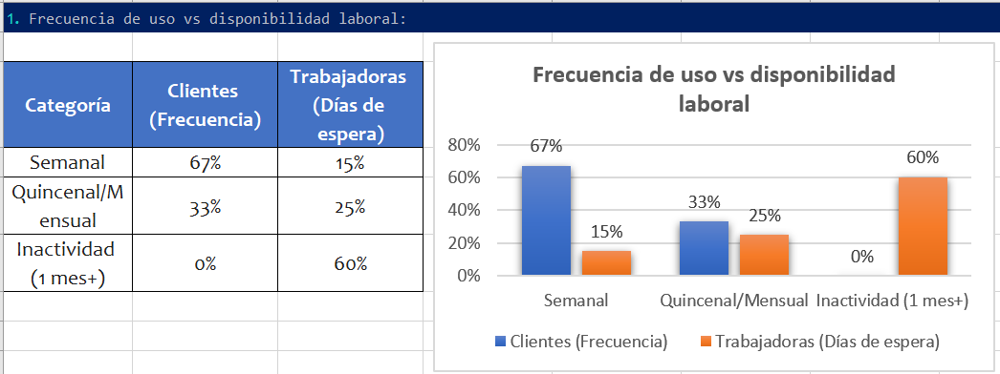

2. Factores de confianza (clientes vs trabajadoras)

**Imagen 9:** *Factores de confianza*

  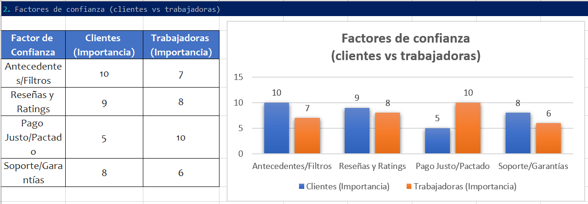

3. Uso y aceptación de plataformas digitales

**Imagen 10:** *Uso y aceptación de plataformas*

  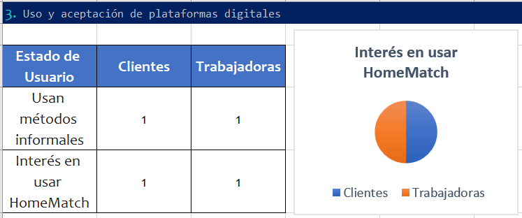

4. Principales dificultades (oferta vs demanda)

**Imagen 11:** *Principales dificultades*

  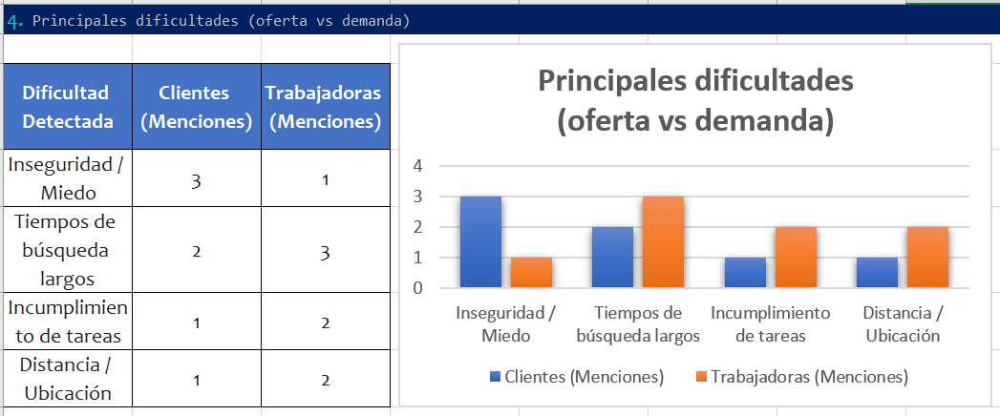

5. Funcionalidades clave esperadas

**Imagen 12:** *Funcionalidades clave esperadas*

  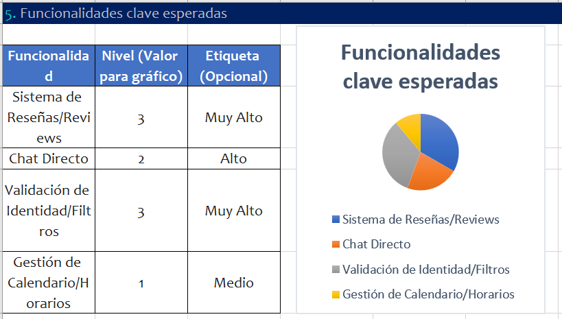

### 2.3. Needfinding

#### 2.3.1. User Personas
La presente sección expone las fichas de User Persona, herramientas fundamentales que representan los arquetipos de nuestros usuarios objetivo: los clientes que demandan servicios domésticos y las trabajadoras del hogar que ofrecen dichos servicios. Estos artefactos se han construido a partir de los hallazgos clave obtenidos en la fase de entrevistas y considerando el análisis competitivo del mercado. Frente a un mercado caracterizado por la informalidad y la falta de verificación en alternativas informales , nuestros User Personas reflejan la necesidad imperativa de confianza, seguridad y flexibilidad. Para los clientes, el arquetipo prioriza la validación de perfiles mediante antecedentes y reseñas ; mientras que, para las trabajadoras, el arquetipo subraya la búsqueda de un entorno seguro, pagos puntuales y control sobre su disponibilidad. A continuación, se detallan los perfiles modelados utilizando la herramienta UXPressia.

*Segmento 1: El Cliente (Segmento Demanda)*

**Imagen 13:** *User Persona de Segmento 1 (Clientes)*

  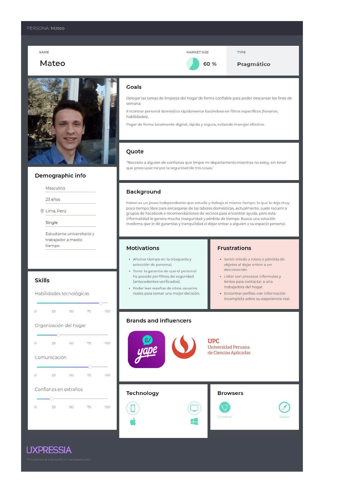

*Segmento 2: Trabajadora del Hogar (Segmento Oferta)*

**Imagen 14:** *User Persona de Segmento 2 (Trabajadora del hogar)*

  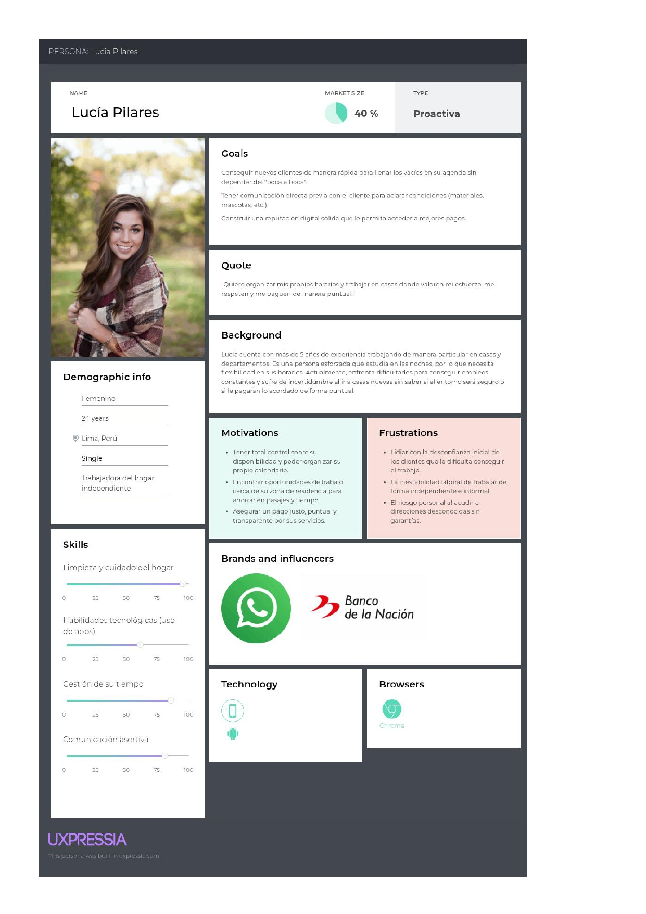

#### 2.3.2. User Task Matrix

##### Introducción:
El siguiente User Task Matrix presenta las principales tareas que realizan los dos segmentos de usuarios identificados. Para este proyecto, consideramos dos segmentos principales: los Clientes 
(quienes demandan los servicios) y las Trabajadoras del hogar (quienes ofrecen los 
servicios). Se identifican actividades clave para cada grupo, evaluadas según su frecuencia e importancia, considerando su experiencia actual sin el uso de la solución propuesta.

**Tabla 10:** *Matriz de tareas de usuario (User Task Matrix) comparativa entre Clientes y Trabajadoras.*

| **Tareas (Tasks)**                     | **Clientes** |  | **Trabajadoras** |  |
| -------------------------------------- | ------------------------- | -------------------------- | ----------------------------- | ------------------------------ |
| | Frecuencia | Importancia | Frecuencia |Importancia|
| Buscar referencias o recomendaciones   | A veces                   | Alta                       | A veces                       | Media                          |
| Evaluar confiabilidad / antecedentes   | A veces                   | Alta                       | A veces                       | Media                          |
| Coordinar fechas, horarios y tareas    | Siempre                   | Alta                       | Siempre                       | Alta                           |
| Negociar tarifas / pago                | A veces                   | Media                      | A veces                       | Alta                           |
| Ejecutar labores domésticas            | -                         | -                          | Siempre                       | Alta                           |
| Supervisar el trabajo realizado        | A veces                   | Media                      | -                             | -                              |
| Realizar / cobrar el pago              | Siempre                   | Alta                       | Siempre                       | Alta                           |
| Recomendar / solicitar recomendaciones | A veces                   | Media                      | A veces                       | Media                          |
| Buscar oportunidades de trabajo        | -                         | -                          | A veces                       | Alta                           |

#### Explicación:

Las tareas con mayor frecuencia e importancia en ambos segmentos son la coordinación de horarios y tareas y el proceso de pago, lo que evidencia que la organización y la seguridad en la transacción son aspectos críticos en la interacción entre clientes y trabajadoras del hogar.

Desde la perspectiva de los clientes, destacan como altamente importantes la búsqueda de referencias y la evaluación de la confiabilidad, aunque no se realizan siempre, lo que refleja una preocupación constante por la seguridad al contratar. En contraste, las trabajadoras del hogar asignan mayor importancia a la negociación del pago y a la búsqueda de oportunidades laborales, lo que evidencia su enfoque en la estabilidad económica.

Una diferencia clave es que los clientes realizan tareas de supervisión, mientras que las trabajadoras se enfocan en la ejecución del servicio, mostrando roles claramente complementarios. Asimismo, ambos coinciden en la importancia de las recomendaciones, lo que indica que la reputación y confianza son elementos centrales en este mercado.

En conjunto, el análisis evidencia una oportunidad para soluciones que reduzcan la desconfianza, faciliten la coordinación y mejoren la visibilidad de la reputación, alineando las necesidades de ambos segmentos.

#### 2.3.3. User Journey Mapping

*Segmento 1: El Cliente (Segmento Demanda)*

**Imagen 15:** *User Journey Mapping de Segmento 1 (Clientes)*

  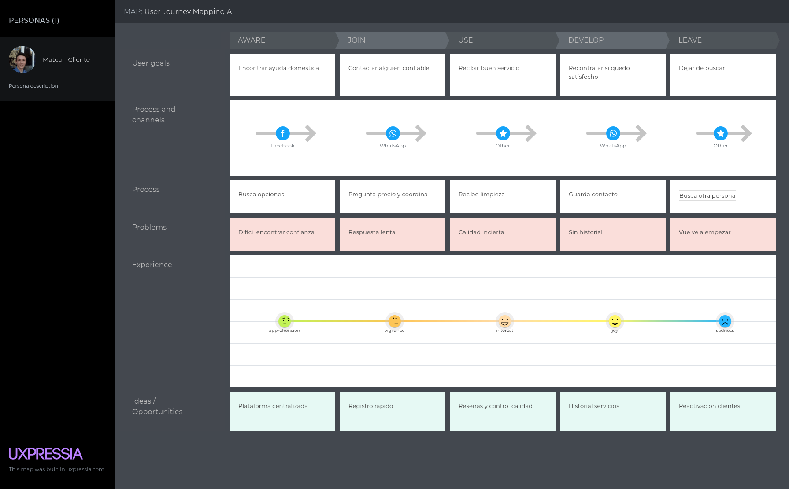

*Segmento 2: Trabajadora del Hogar (Segmento Oferta)*

**Imagen 16:** *User Journey Mapping de Segmento 2 (Trabajadora del Hogar)*

  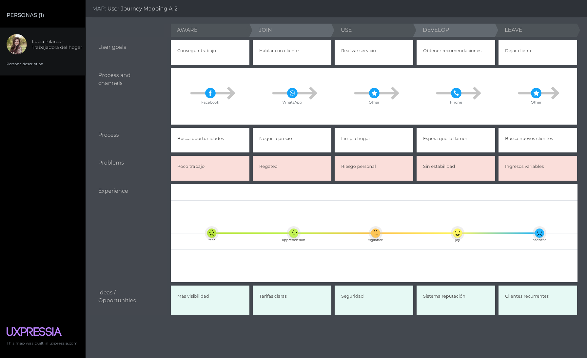

#### 2.3.4. Empathy Mapping

*Segmento 1: El Cliente (Segmento Demanda)*

**Imagen 17:** *Empathy Mapping de Segmento 1 (Clientes)*

  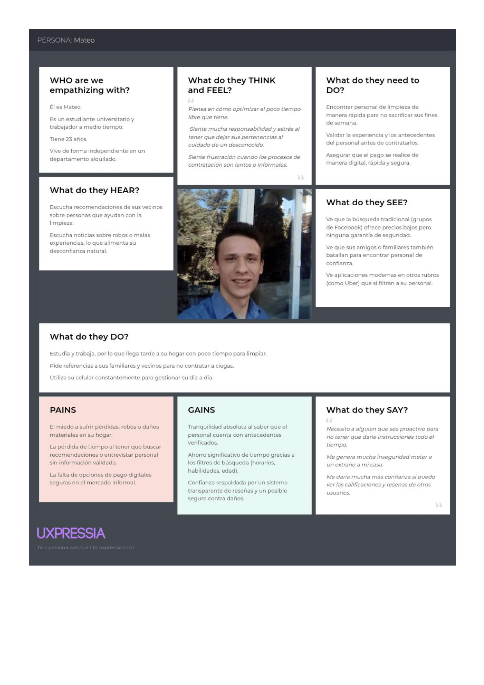

*Segmento 2: Trabajadora del Hogar (Segmento Oferta)*

**Imagen 18:** *Empathy Mapping de Segmento 2 (Trabajadora del hogar)*

  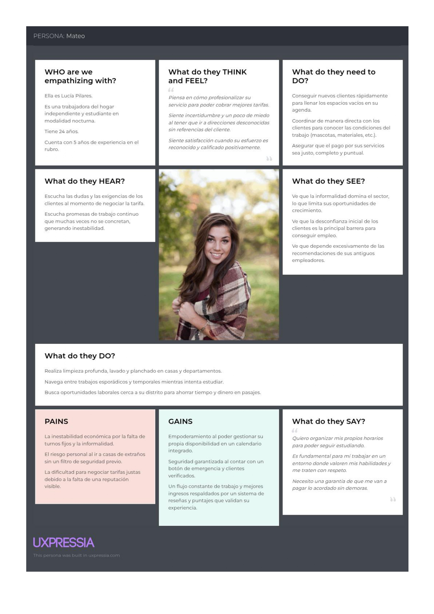

### 2.4. Big Picture EventStorming 

**Imagen 19:** *Big Picture EventStorming*

  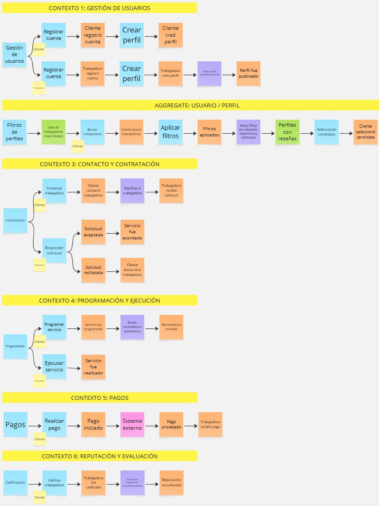

### 2.5. Ubiquitous Language

Este será el lenguaje común utilizado en la plataforma de servicios domésticos, permitiendo que todos los miembros del equipo y stakeholders comprendan claramente los conceptos clave del dominio del negocio.

#### Customer
Usuario que solicita servicios domésticos a través de la plataforma, como limpieza, cocina o cuidado del hogar.

#### Domestic Worker
Persona que ofrece servicios domésticos mediante la plataforma, incluyendo limpieza, cocina, cuidado de niños u otras tareas del hogar.

#### Service
Actividad doméstica acordada entre el cliente y la trabajadora, con condiciones específicas como tareas, duración, ubicación y horario.

#### Service Request 
Petición inicial realizada por el cliente para contactar a una trabajadora y proponer la realización de un servicio.

#### Booking
Confirmación formal del servicio entre cliente y trabajadora, incluyendo fecha, hora y condiciones acordadas.

#### Availability
Información proporcionada por la trabajadora sobre los días y horarios en los que puede ofrecer sus servicios.

#### Profile
Conjunto de información del usuario (cliente o trabajadora), que incluye datos personales, experiencia, habilidades, reseñas y calificaciones.

#### Rating
Puntuación otorgada por un usuario (cliente o trabajadora) después de la realización de un servicio.

#### Review
Comentario cualitativo que acompaña la calificación, basado en la experiencia del servicio realizado.

#### Reputation
Valor acumulado basado en las calificaciones y reseñas de un usuario, que refleja su confiabilidad dentro de la plataforma.

#### Payment
Transacción económica realizada por el cliente a cambio del servicio brindado por la trabajadora.

#### Payment Confirmation
Validación de que el pago fue realizado correctamente y recibido por la trabajadora.

#### Service History
Registro de todos los servicios realizados por un usuario dentro de la plataforma.

#### Matching
Proceso mediante el cual la plataforma conecta clientes con trabajadoras en función de criterios como ubicación, disponibilidad, experiencia y calificaciones.

#### Filter
Herramienta utilizada por el cliente para refinar la búsqueda de trabajadoras según criterios específicos.

#### Notification
Mensaje automático enviado por la plataforma para informar sobre solicitudes, confirmaciones, recordatorios o actualizaciones.

#### Cancellation
Acción de anular un servicio previamente acordado por parte del cliente o la trabajadora.

#### Agreement
Condiciones definidas entre cliente y trabajadora antes de ejecutar el servicio, incluyendo tareas, pago y horario.

#### Security
Percepción de confianza del usuario al utilizar la plataforma, relacionada con la verificación de perfiles, pagos y evaluaciones.

#### Trust
Nivel de credibilidad que un usuario tiene sobre otro, basado en reputación, reseñas y experiencia previa.

#### Support
Asistencia brindada a los usuarios para resolver dudas, problemas o inconvenientes relacionados con el servicio.

## Capítulo III: Requirements Specification

### 3.1. User Stories

**Tabla 11:** *Especificación detallada de Epics y User Stories con criterios de aceptación.*

| Epic / Story ID | Título | Descripción | Criterios de Aceptación | Relacionado con (Epic ID) |
|----------------|--------|------------|--------------------------|----------------------------|
| EP-01 | Gestión de usuarios | Como usuario, deseo gestionar mi cuenta para acceder de forma segura al sistema | - | - |
| EP-02 | Búsqueda y filtrado | Como cliente, deseo buscar y filtrar trabajadoras para encontrar opciones adecuadas | - | - |
| EP-03 | Perfiles y reseñas | Como cliente, deseo visualizar perfiles y reseñas para tomar decisiones informadas | - | - |
| EP-04 | Contratación y pagos | Como cliente, deseo contratar servicios para gestionar solicitudes y pagos | - | - |
| EP-05 | Comunicación y notificaciones | Como usuario, deseo comunicarme y recibir notificaciones para coordinar servicios | - | - |
| EP-06 | Gestión de disponibilidad | Como trabajadora, deseo gestionar mi disponibilidad para organizar mis horarios | - | - |
| EP-07 | Seguridad y cumplimiento | Como usuario, deseo proteger mis datos para garantizar privacidad | - | - |
| US-01 | Registro de cliente | Como cliente, deseo registrarme para acceder a la plataforma | Given que el cliente ingresa datos válidos, when envía el formulario, then el sistema crea la cuenta.    Given que los datos son inválidos, when envía el formulario, then el sistema muestra error. | EP-01 |
| US-02 | Inicio de sesión cliente | Como cliente, deseo iniciar sesión para acceder a mi cuenta | Given que las credenciales son correctas, when inicia sesión, then el sistema permite acceso.    Given que son incorrectas, when inicia sesión, then el sistema rechaza acceso. | EP-01 |
| US-03 | Editar perfil cliente | Como cliente, deseo actualizar mis datos para mantener información correcta | Given que los datos son válidos, when guarda cambios, then el sistema actualiza la información.    Given que son inválidos, when guarda cambios, then el sistema muestra error. | EP-01 |
| US-20 | Recuperar contraseña cliente | Como cliente, deseo recuperar mi contraseña para acceder nuevamente | Given que el correo está registrado, when solicita recuperación, then el sistema envía enlace.    Given que no está registrado, when solicita recuperación, then el sistema muestra error. | EP-01 |
| US-04 | Filtrar por ubicación | Como cliente, deseo filtrar por ubicación para encontrar trabajadoras cercanas | Given que existen resultados, when realiza búsqueda, then el sistema muestra coincidencias.    Given que no existen resultados, when busca, then el sistema informa ausencia. | EP-02 |
| US-06 | Filtrar por habilidades | Como cliente, deseo filtrar por habilidades para encontrar opciones adecuadas | Given que existen coincidencias, when aplica filtros, then el sistema muestra resultados.    Given que no existen coincidencias, when aplica filtros, then el sistema muestra lista vacía. | EP-02 |
| US-07 | Filtrar por disponibilidad | Como cliente, deseo filtrar por horario para encontrar disponibilidad | Given que hay disponibilidad, when busca, then el sistema muestra resultados.    Given que no hay disponibilidad, when busca, then el sistema informa ausencia. | EP-02 |
| US-10 | Ordenar resultados | Como cliente, deseo ordenar resultados para elegir mejor opción | Given que selecciona criterio, when aplica orden, then el sistema ordena resultados. | EP-02 |
| US-05 | Ver perfiles | Como cliente, deseo visualizar perfiles para evaluar opciones | Given que el perfil está completo, when accede, then el sistema muestra información.    Given que está incompleto, when accede, then el sistema muestra advertencia. | EP-03 |
| US-09 | Ver reseñas | Como cliente, deseo ver reseñas para tomar decisiones informadas | Given que existen reseñas, when accede, then el sistema las muestra.    Given que no existen, when accede, then el sistema lo indica. | EP-03 |
| US-14 | Calificar servicio | Como cliente, deseo calificar servicios para compartir experiencia | Given que el servicio finalizó, when registra calificación, then el sistema guarda la evaluación. | EP-03 |
| US-17 | Reportar trabajadora | Como cliente, deseo reportar perfiles sospechosos para mejorar seguridad | Given que detecta perfil sospechoso, when envía reporte, then el sistema lo registra. | EP-03 |
| US-08 | Contratar servicio | Como cliente, deseo contratar servicios para agendar atención | Given que hay disponibilidad, when agenda servicio, then el sistema registra solicitud.    Given que no hay disponibilidad, when agenda, then el sistema rechaza operación. | EP-04 |
| US-11 | Método de pago | Como cliente, deseo seleccionar método de pago para completar servicio | Given que el servicio está activo, when selecciona método, then el sistema lo registra. | EP-04 |
| US-12 | Generar comprobante cliente | Como cliente, deseo recibir comprobante para validar pago | Given que el pago se completa, when finaliza servicio, then el sistema genera comprobante. | EP-04 |
| US-15 | Cancelar servicio | Como cliente, deseo cancelar servicio para reorganizarme | Given que está dentro del plazo, when cancela, then el sistema procesa cancelación.    Given que no está permitido, when cancela, then el sistema rechaza. | EP-04 |
| US-16 | Historial cliente | Como cliente, deseo ver historial para revisar servicios | Given que existen registros, when accede, then el sistema muestra historial. | EP-04 |
| US-13 | Mensajería cliente | Como cliente, deseo comunicarme para coordinar servicios | Given que existe conexión, when envía mensaje, then el sistema lo entrega. | EP-05 |
| US-18 | Notificaciones cliente | Como cliente, deseo recibir notificaciones para estar informado | Given que ocurre evento, when se genera, then el sistema envía notificación. | EP-05 |
| US-21 | Registro trabajadora | Como trabajadora, deseo registrarme para ofrecer servicios | Given que datos válidos, when envía formulario, then el sistema crea cuenta. | EP-01 |
| US-22 | Completar perfil trabajadora | Como trabajadora, deseo completar perfil para ser visible | Given que datos completos, when guarda, then el sistema marca perfil completo. | EP-03 |
| US-23 | Verificación trabajadora | Como trabajadora, deseo ser verificada para ofrecer servicios | Given que datos válidos, when se revisa, then el sistema aprueba cuenta. | EP-03 |
| US-24 | Login trabajadora | Como trabajadora, deseo iniciar sesión para gestionar servicios | Given que credenciales válidas, when inicia sesión, then el sistema permite acceso. | EP-01 |
| US-25 | Editar perfil trabajadora | Como trabajadora, deseo actualizar datos para mantener información correcta | Given que datos válidos, when guarda cambios, then el sistema actualiza información. | EP-01 |
| US-26 | Gestión de disponibilidad | Como trabajadora, deseo gestionar disponibilidad para organizar agenda | Given que modifica disponibilidad, when guarda cambios, then el sistema actualiza calendario. | EP-06 |
| US-27 | Mensajería trabajadora | Como trabajadora, deseo comunicarme para coordinar servicios | Given que envía mensaje, when existe conexión, then el sistema lo entrega. | EP-05 |
| US-28 | Reportar cliente | Como trabajadora, deseo reportar clientes para mejorar seguridad | Given que detecta perfil sospechoso, when reporta, then el sistema registra reporte. | EP-03 |
| US-29 | Comprobante trabajadora | Como trabajadora, deseo recibir comprobante para validar ingresos | Given que servicio finaliza, when se procesa pago, then el sistema genera comprobante. | EP-04 |
| US-30 | Notificaciones trabajadora | Como trabajadora, deseo recibir notificaciones para estar informada | Given que ocurre evento, when se genera, then el sistema envía notificación. | EP-05 |
| US-31 | Historial trabajadora | Como trabajadora, deseo ver historial para registrar servicios | Given que existen registros, when accede, then el sistema muestra historial. | EP-04 |
| US-32 | Seguridad trabajadora | Como trabajadora, deseo proteger mis datos para garantizar privacidad | Given que se transmiten datos, when ocurre comunicación, then el sistema usa cifrado. | EP-07 |
| US-33 | Recuperar contraseña trabajadora | Como trabajadora, deseo recuperar contraseña para acceder nuevamente | Given que correo válido, when solicita recuperación, then el sistema envía enlace. | EP-01 |
| US-34 | Ver comisión | Como trabajadora, deseo ver comisión para conocer pagos a plataforma | Given que existen servicios, when consulta, then el sistema calcula comisión. | EP-04 |
| US-35 | Descuento comisión | Como trabajadora, deseo pagar comisión automáticamente para cumplir obligaciones | Given que hay fondos, when se ejecuta cobro, then el sistema descuenta comisión. | EP-04 |
| US-L01 | Visualizar servicio | Como usuario, deseo conocer el servicio para entender la plataforma | Given que accede al sitio, when carga la página, then el sistema muestra información. | EP-02 |
| US-L03 | Entender proceso | Como usuario, deseo ver cómo funciona para saber cómo contratar | Given que accede a sección, when navega, then el sistema muestra proceso. | EP-02 |
| US-L05 | Navegación | Como usuario, deseo navegar para explorar contenido | Given que interactúa con la página, when selecciona sección, then el sistema permite navegación. | EP-02 |
| TS-01 | API registro | Como developer, deseo registrar usuarios para crear cuentas | Given datos válidos, when request, then responde 201. | EP-01 |
| TS-02 | API login | Como developer, deseo autenticar usuarios para acceso | Given credenciales válidas, when request, then responde token. | EP-01 |
| TS-04 | API búsqueda | Como developer, deseo buscar con filtros para obtener resultados | Given datos existentes, when consulta, then retorna lista. | EP-02 |
| TS-05 | API crear servicio | Como developer, deseo registrar servicios para contrataciones | Given datos válidos, when request, then crea servicio. | EP-04 |
| TS-06 | API cancelar servicio | Como developer, deseo cancelar servicios para gestión | Given cancelación válida, when request, then cancela servicio. | EP-04 |
| TS-10 | API notificaciones | Como developer, deseo enviar notificaciones para eventos | Given evento, when ocurre, then envía notificación. | EP-05 |

### 3.2. Impact Mapping
A continuación se visualiza el **Impact Map** del proyecto, donde se muestra la relación entre el *Business Goal* definido, los **User Personas** identificados, los **Impactos** esperados en su comportamiento, los **Deliverables** que como negocio digital podemos ofrecer y las **User Stories** asociadas que permitirán implementar las funcionalidades necesarias en la aplicación web y la landing page. Este mapa busca asegurar la alineación entre los objetivos estratégicos y el desarrollo de la solución digital.

**Imagen 20:** *Impact Mapping*

  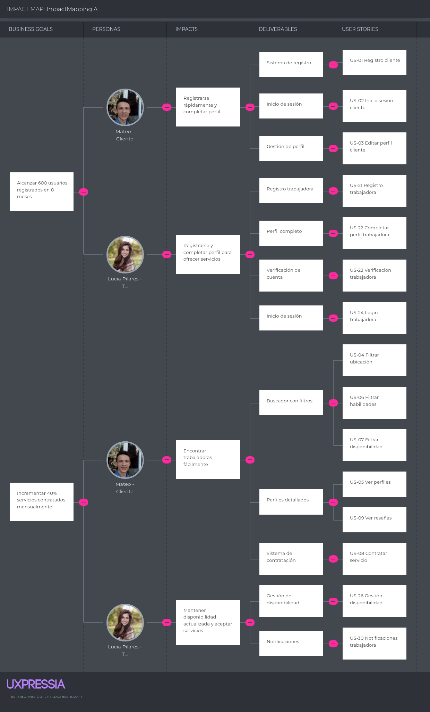

Link: https://drive.google.com/file/d/1BR5BatpnbY6CP7mPb5e2RJWy8tfnCuxR/view?usp=sharing 

### 3.3. Product Backlog

**Tabla 12:** *Product Backlog priorizado con estimación de Story Points.*

| # Orden | User Story ID | Título | Descripción | Story Points |
|--------|--------------|--------|------------|--------------|
| 1 | US-L01 | Visualizar servicio | Como usuario, deseo conocer el servicio para entender la plataforma | 3 |
| 2 | US-L03 | Entender proceso | Como usuario, deseo ver cómo funciona para saber cómo contratar | 3 |
| 3 | US-L05 | Navegación | Como usuario, deseo navegar para explorar contenido | 2 |
| 4 | US-05 | Ver perfiles | Como cliente, deseo visualizar perfiles para evaluar opciones | 5 |
| 5 | US-09 | Ver reseñas | Como cliente, deseo ver reseñas para tomar decisiones informadas | 3 |
| 6 | US-04 | Filtrar por ubicación | Como cliente, deseo filtrar por ubicación para encontrar trabajadoras cercanas | 5 |
| 7 | US-06 | Filtrar por habilidades | Como cliente, deseo filtrar por habilidades para encontrar opciones adecuadas | 5 |
| 8 | US-07 | Filtrar por disponibilidad | Como cliente, deseo filtrar por horario para encontrar disponibilidad | 5 |
| 9 | US-10 | Ordenar resultados | Como cliente, deseo ordenar resultados para elegir mejor opción | 2 |
| 10 | US-01 | Registro de cliente | Como cliente, deseo registrarme para acceder a la plataforma | 5 |
| 11 | US-02 | Inicio de sesión cliente | Como cliente, deseo iniciar sesión para acceder a mi cuenta | 3 |
| 12 | US-03 | Editar perfil cliente | Como cliente, deseo actualizar mis datos para mantener información correcta | 3 |
| 13 | US-20 | Recuperar contraseña cliente | Como cliente, deseo recuperar mi contraseña para acceder nuevamente | 2 |
| 14 | US-08 | Contratar servicio | Como cliente, deseo contratar servicios para agendar atención | 8 |
| 15 | US-11 | Método de pago | Como cliente, deseo seleccionar método de pago para completar servicio | 5 |
| 16 | US-12 | Generar comprobante cliente | Como cliente, deseo recibir comprobante para validar pago | 3 |
| 17 | US-15 | Cancelar servicio | Como cliente, deseo cancelar servicio para reorganizarme | 3 |
| 18 | US-16 | Historial cliente | Como cliente, deseo ver historial para revisar servicios | 3 |
| 19 | US-13 | Mensajería cliente | Como cliente, deseo comunicarme para coordinar servicios | 5 |
| 20 | US-18 | Notificaciones cliente | Como cliente, deseo recibir notificaciones para estar informado | 3 |
| 21 | US-21 | Registro trabajadora | Como trabajadora, deseo registrarme para ofrecer servicios | 5 |
| 22 | US-22 | Completar perfil trabajadora | Como trabajadora, deseo completar perfil para ser visible | 5 |
| 23 | US-23 | Verificación trabajadora | Como trabajadora, deseo ser verificada para ofrecer servicios | 8 |
| 24 | US-24 | Login trabajadora | Como trabajadora, deseo iniciar sesión para gestionar servicios | 3 |
| 25 | US-25 | Editar perfil trabajadora | Como trabajadora, deseo actualizar datos para mantener información correcta | 3 |
| 26 | US-26 | Gestión de disponibilidad | Como trabajadora, deseo gestionar disponibilidad para organizar agenda | 5 |
| 27 | US-27 | Mensajería trabajadora | Como trabajadora, deseo comunicarme para coordinar servicios | 5 |
| 28 | US-28 | Reportar cliente | Como trabajadora, deseo reportar clientes para mejorar seguridad | 2 |
| 29 | US-29 | Comprobante trabajadora | Como trabajadora, deseo recibir comprobante para validar ingresos | 3 |
| 30 | US-30 | Notificaciones trabajadora | Como trabajadora, deseo recibir notificaciones para estar informada | 3 |
| 31 | US-31 | Historial trabajadora | Como trabajadora, deseo ver historial para registrar servicios | 3 |
| 32 | US-33 | Recuperar contraseña trabajadora | Como trabajadora, deseo recuperar contraseña para acceder nuevamente | 2 |
| 33 | US-14 | Calificar servicio | Como cliente, deseo calificar servicios para compartir experiencia | 2 |
| 34 | US-17 | Reportar trabajadora | Como cliente, deseo reportar perfiles sospechosos para mejorar seguridad | 2 |
| 35 | US-34 | Ver comisión | Como trabajadora, deseo ver comisión para conocer pagos a plataforma | 3 |
| 36 | US-35 | Descuento comisión | Como trabajadora, deseo pagar comisión automáticamente para cumplir obligaciones | 5 |
| 37 | TS-04 | API búsqueda | Como developer, deseo buscar con filtros para obtener resultados | 5 |
| 38 | TS-05 | API crear servicio | Como developer, deseo registrar servicios para contrataciones | 5 |
| 39 | TS-06 | API cancelar servicio | Como developer, deseo cancelar servicios para gestión | 3 |
| 40 | TS-10 | API notificaciones | Como developer, deseo enviar notificaciones para eventos | 3 |
| 41 | TS-01 | API registro | Como developer, deseo registrar usuarios para crear cuentas | 5 |
| 42 | TS-02 | API login | Como developer, deseo autenticar usuarios para acceso | 3 |
| 43 | US-L01 | Registro de trabajador | Como profesional de limpieza, deseo registrarme mediante un formulario modal ingresando mis datos y preferencias (correo, contraseña, ubicación, tipo de servicio, idioma) para ofrecer mis servicios en la plataforma. | 5 |
| 44 | US-L02 | Registro de cliente | Como cliente potencial, deseo crear una cuenta a través de un modal ingresando mis datos personales (nombre, apellidos, DNI, celular, correo) para poder contratar personal doméstico. | 5 |
| 45 | US-L03 | Inicio de sesión unificado | Como usuario registrado (cliente o trabajador), deseo iniciar sesión desde la barra de navegación con mi correo y contraseña para acceder a mi panel de gestión. | 3 |
| 46 | US-L04 | Recuperación de credenciales | Como usuario, deseo tener acceso a la opción "¿Olvidaste tu contraseña?" en el modal de inicio de sesión para restablecer mi acceso mediante un flujo seguro de correo electrónico. | 3 |
| 47 | US-L05 | Búsqueda paramétrica de servicios | Como cliente, deseo utilizar un motor de búsqueda inteligente en la página principal filtrando por ubicación, tipo de servicio, disponibilidad, calificación e idioma para encontrar profesionales altamente compatibles. | 8 |
| 48 | US-L06 | Navegación por categorías | Como cliente, deseo filtrar el motor de búsqueda principal mediante pestañas de categorías (Limpieza, Cocina, Jardín, Cuidados) para delimitar mi requerimiento de forma rápida. | 2 |
| 49 | US-L07 | Suscripción a Newsletter | Como visitante, deseo suscribirme al boletín ingresando mi correo electrónico en el footer para recibir actualizaciones de la plataforma, validando previamente el formato de mi correo. | 2 |
| 50 | US-L08 | Visualización de propuesta de valor | Como visitante, deseo visualizar los beneficios clave (antecedentes verificados, pagos seguros, reservas flexibles) en la sección "Features" para entender las garantías de la plataforma. | 3 |
| 51 | US-L09 | Consumo de testimonios | Como visitante, deseo leer reseñas de otros clientes verificados para evaluar la confiabilidad del servicio antes de tomar una decisión de registro o compra. | 2 |
| 52 | US-L10 | Adaptabilidad móvil (Menú Hamburguesa) | Como usuario de dispositivos móviles, deseo acceder a un menú colapsable interactivo para poder navegar por las distintas secciones de la página de forma ergonómica. | 3 |

**Imagen 21:** *Product Backlog en Trello*

  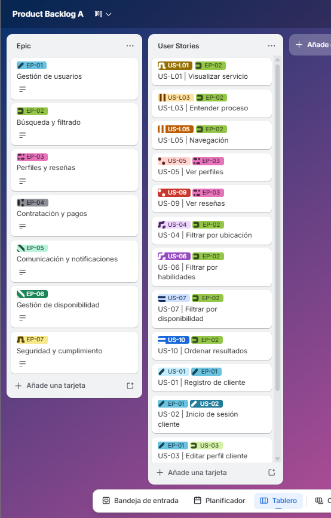

Link: https://trello.com/invite/b/69e53cf162d5cd735ac20f75/ATTI28be5c17f5cd08eeea20dd1e0e323b79C619AC52/product-backlog-a

## Capítulo IV: Product Design

### 4.1. Style Guidelines

#### 4.1.1. General Style Guidelines

InCleanHome establece un sistema de diseño coherente que refleja los valores centrales de la plataforma: confianza, limpieza, seguridad y accesibilidad. Las decisiones visuales buscan transmitir profesionalismo y calidez simultáneamente, generando confianza en los usuarios al momento de contratar personal doméstico.

**Branding**

**Imagen 22:** *Logo de InCleanHome*

    

El nombre "InCleanHome" comunica de manera directa el propósito del producto: conectar hogares con personal de limpieza de confianza. El logotipo es una casa junto al nombre en tipografía Nunito Black, combinando cercanía y modernidad. La identidad visual apuesta por un estilo limpio y contemporáneo, evitando la sobrecarga visual.

**Paleta de colores**

**Imagen 23:** *Paleta de Colores de InCleanHome*

    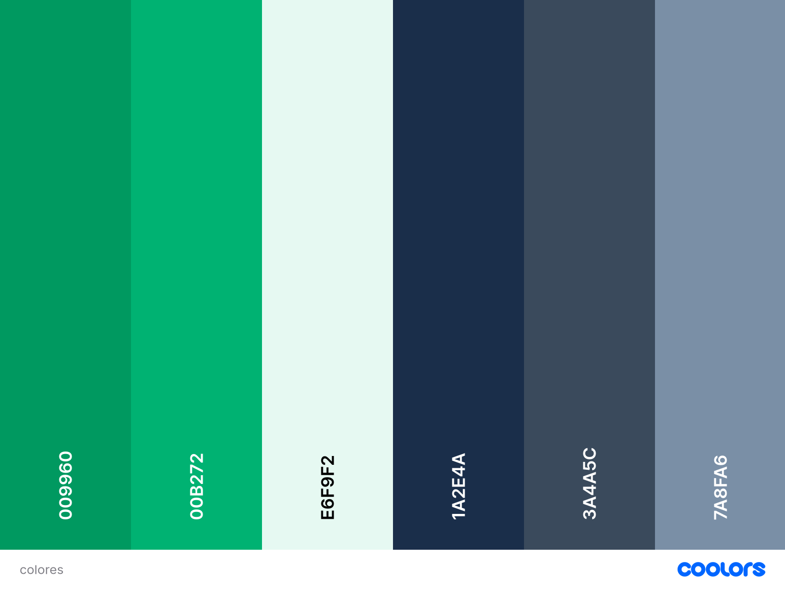

**Tabla 13:** *Tokens de diseño y valores hexadecimales de la paleta cromática.*

| Token          | Valor HEX | Uso principal                                      |
|----------------|-----------|----------------------------------------------------|
| `--green`      | `#00b272` | Color primario de marca, botones CTA, iconos       |
| `--green-dark` | `#009960` | Estado hover de elementos primarios                |
| `--green-light`| `#e6f9f2` | Fondos secundarios, destacados suaves              |
| `--navy`       | `#1a2e4a` | Títulos, texto de alto contraste, footer           |
| `--text`       | `#3a4a5c` | Texto de cuerpo general                            |
| `--text-light` | `#7a8fa6` | Texto secundario, etiquetas, placeholders          |
| `--bg`         | `#f7fafc` | Fondo de tarjetas y secciones alternas             |
| `--white`      | `#ffffff` | Fondo principal, superficies de componentes        |
| `--border`     | `#e2edf5` | Bordes de tarjetas, inputs, divisores              |

El verde `#00b272` fue seleccionado por su asociación cultural con la naturaleza, limpieza y crecimiento, mientras que el azul marino `#1a2e4a` transmite autoridad, seguridad y profesionalismo, creando un equilibrio visual entre frescura y confianza.

**Tipografía**

- **Nunito** (pesos 400, 600, 700, 800, 900): tipografía principal para títulos, logotipo, botones y elementos de navegación. Su forma redondeada aporta cercanía y modernidad.
- **Inter** (pesos 400, 500, 600): tipografía secundaria para texto de cuerpo, párrafos descriptivos y etiquetas de formulario. Optimizada para legibilidad en pantalla.

La escala tipográfica usa `clamp()` para adaptación fluida entre dispositivos:
- Headings principales: `clamp(32px, 5vw, 52px)`
- Headings de sección: `clamp(26px, 4vw, 38px)`
- Cuerpo de texto: 14–16px
- Etiquetas y texto auxiliar: 12–13px

**Espaciado y forma**

El sistema de espaciado utiliza múltiplos de 4px como base. Los radios de borde son:
- `--radius: 12px` — para tarjetas, inputs y elementos medianos
- `--radius-lg: 20px` — para contenedores de mayor jerarquía visual

Las sombras siguen una escala de elevación:
- `--shadow`: `0 4px 24px rgba(26,46,74,0.08)` — sombra suave para hover
- `--shadow-lg`: `0 12px 40px rgba(26,46,74,0.14)` — sombra de alta elevación

**Tono de comunicación**

InCleanHome adopta un tono **formal pero cercano**, con un lenguaje claro y directo. Se evita el tecnicismo innecesario. Los mensajes destacan la seguridad y verificación como valores centrales, generando confianza sin resultar intimidantes. La comunicación es **entusiasta pero serena**, transmitiendo seguridad en lugar de urgencia.

---
#### 4.1.2. Web Style Guidelines

Las guías de estilo web definen los estándares de interacción y presentación para las interfaces responsivas de InCleanHome, aplicables tanto al Landing Page como a la futura Web Application.

**Botones**

Se definen cuatro variantes de botón con comportamientos hover estandarizados:

- **Primary** (`btn-primary`): fondo verde `#00b272`, texto blanco. En hover: `#009960` con elevación de `translateY(-1px)` y sombra verde.
- **Outline** (`btn-outline`): borde azul marino, texto azul marino. En hover: relleno sólido azul marino con texto blanco.
- **White** (`btn-white`): fondo blanco con texto verde oscuro. Usado sobre fondos oscuros.
- **Outline White** (`btn-outline-white`): borde semitransparente blanco. Usado en el banner CTA.

Todos los botones comparten: `padding: 12px 24px`, `border-radius: 8px`, `font-weight: 700`, fuente Nunito y `transition: 0.3s cubic-bezier(0.4,0,0.2,1)`.

**Tarjetas (Cards)**

Las tarjetas de características y reseñas utilizan fondo `#f7fafc`, borde `1px solid #e2edf5` y `border-radius: 20px`. En hover aplican `translateY(-4px)` con sombra aumentada, generando sensación de elevación interactiva.

**Formularios**

Los inputs y selects siguen un estilo unificado: fondo `#f7fafc`, borde `1.5px solid #e2edf5`, `border-radius: 8px`. En estado focus el borde cambia a verde `#00b272` y el fondo a blanco, señalizando claramente el campo activo. Las etiquetas usan texto en mayúsculas de 12px con letra `#7a8fa6`.

**Navegación**

La navbar es sticky con `z-index: 100`, fondo blanco y sombra que se incrementa al hacer scroll (manejada por JavaScript). En mobile (≤768px) los enlaces se ocultan y aparece un botón hamburger animado que despliega un menú vertical.

**Animaciones y transiciones**

Los elementos con `[data-animate]` inician con `opacity: 0` y `translateY(24px)`, y al entrar al viewport reciben la clase `visible` que los anima a su posición final. El `IntersectionObserver` aplica un stagger de 120ms entre elementos hermanos. La transición base es `0.3s cubic-bezier(0.4,0,0.2,1)` para una sensación fluida y moderna.

**Responsive Breakpoints**

**Tabla 14:** *Configuración de Breakpoints para el diseño responsivo.*

| Breakpoint | Cambios principales                                                    |
|------------|------------------------------------------------------------------------|
| ≤ 1024px   | Footer de 4 columnas pasa a 2 columnas                                 |
| ≤ 768px    | Nav colapsa a hamburger, hero pasa a 1 columna, grids a 1 col          |
| ≤ 480px    | Título hero a 28px, botones hero en columna, formulario en 1 columna   |

---

### 4.2. Information Architecture

#### 4.2.1. Organization Systems

InCleanHome organiza su contenido bajo los siguientes principios:

**Organización jerárquica (Visual Hierarchy):** La estructura del Landing Page sigue una jerarquía descendente de importancia: hero con propuesta de valor → beneficios clave (features) → buscador de servicios → testimonios → llamada a la acción. Esta secuencia guía al usuario desde el descubrimiento hasta la conversión de manera progresiva.

**Organización por audiencia (Audience-based):** El contenido está diferenciado según dos segmentos objetivo:
- *Familias y hogares* que buscan contratar personal doméstico verificado.
- *Trabajadores del hogar* que desean registrarse como proveedores de servicios.

El CTA principal ("Buscar ahora") dirige a familias al buscador. El CTA secundario ("Ser un/a limpiador/a") dirige a trabajadores al formulario de registro.

**Organización por categoría temática:** Los servicios se agrupan en cuatro categorías identificadas con tabs: Limpieza, Cocina, Jardín y Cuidados, permitiendo al usuario filtrar contenido según su necesidad específica.

**Organización secuencial:** El proceso de búsqueda sigue pasos claros: selección de ciudad → tipo de servicio → disponibilidad → calificación mínima → idioma → búsqueda. Esta secuencia reduce la carga cognitiva.

---

#### 4.2.2. Labeling Systems

Las etiquetas de InCleanHome siguen el principio de mínima cantidad de palabras con máxima claridad:

**Tabla 15:** *Estructura del sistema de etiquetado (Labeling System).*

| Etiqueta               | Contexto de uso                         | Significado para el usuario                     |
|------------------------|-----------------------------------------|-------------------------------------------------|
| Cómo Funciona          | Navbar                                  | Proceso explicado paso a paso                   |
| Servicios              | Navbar                                  | Catálogo de tipos de servicios disponibles       |
| Nosotros               | Navbar                                  | Información sobre la empresa y el equipo         |
| Iniciar sesión         | Navbar (acción)                         | Acceso a cuenta existente                        |
| Ser un/a limpiador/a   | Navbar (CTA secundario)                 | Registro como proveedor de servicios             |
| Busca ahora            | Hero (CTA primario)                     | Acceso directo al formulario de búsqueda         |
| Antecedentes Verificados | Feature card                          | Validación de identidad del trabajador           |
| Pagos Digitales Seguros | Feature card                           | Sistema de cobro sin efectivo                    |
| Reservas Flexibles     | Feature card                            | Gestión de horarios sin restricciones            |
| Ubicación              | Filtro de búsqueda                      | Ciudad del usuario para resultados relevantes    |
| Calificación Min.      | Filtro de búsqueda                      | Umbral mínimo de estrellas del profesional       |
| Buscar profesionales   | Botón de búsqueda                       | Ejecutar la búsqueda con los filtros aplicados   |
| ✓ Verificada / ✓ Recurrente | Badge en reseñas                 | Credencial de confianza del reseñador            |

---

#### 4.2.3. SEO Tags and Meta Tags

**Title:** InCleanHome – Encuentra Personal Doméstico Confiable y Verificado

**Description:** Conecta con personal doméstico verificado para tu hogar. Reserva servicios de
limpieza, cocina, jardín y cuidados en minutos, con pagos digitales seguros y trabajadores con
antecedentes verificados.

**Keywords:** Personal doméstico, servicio de limpieza, limpieza del hogar, trabajadora doméstica
verificada, contratar limpiadora, servicio de cocina a domicilio, cuidado del hogar, reserva de
servicios domésticos, plataforma doméstica online

**Meta Tags:** - Viewport: width=device-width, initial-scale=1.0 - Charset: UTF-8 - Author:
InCleanHome Team - Robots: index, follow - Language: es-419, en-US

#### 4.2.4. Searching Systems

InCleanHome proporciona un sistema de búsqueda estructurado que guía al usuario mediante filtros predefinidos, evitando la búsqueda por texto libre que podría resultar en confusión o resultados irrelevantes.

**Búsqueda filtrada (sección Search del Landing Page):**

El formulario de búsqueda ofrece los siguientes filtros combinables:

**Tabla 16:** *Configuración de filtros del sistema de búsqueda principal.*

| Filtro              | Tipo de control | Opciones disponibles                                          |
|---------------------|-----------------|---------------------------------------------------------------|
| Ubicación           | Select          | Selecciona tu ciudad / CDMX / Guadalajara / Monterrey / Lima / Bogotá |
| Tipo de Servicio    | Select          | Limpieza profunda / Limpieza regular / Limpieza de mudanza   |
| Disponibilidad      | Date picker     | Selección de fecha en calendario                              |
| Calificación Mínima | Select          | Todas / 4+ estrellas / 4.5+ estrellas                        |
| Idioma              | Select          | Inglés/Español / Solo Español / Solo Inglés                   |

Los resultados se presentan en menos de 30 segundos según la promesa de la plataforma. El botón de búsqueda incluye feedback visual (spinner animado) durante la carga.

**Categorías por tabs:** La sección de búsqueda incluye tabs para Limpieza, Cocina, Jardín y Cuidados, permitiendo categorización previa antes de aplicar filtros.

**Presentación de resultados:** Los profesionales encontrados se muestran con nombre, foto, calificación en estrellas, especialidad y disponibilidad, ordenados por relevancia y calificación.

---

#### 4.2.5. Navigation Systems

InCleanHome implementa los siguientes mecanismos de navegación:

**Navegación principal (Navbar sticky):** Accesible desde cualquier punto del scroll, incluye los enlaces Cómo Funciona, Servicios y Nosotros, además de las acciones Iniciar sesión y Ser un/a limpiador/a. En mobile se convierte en menú hamburger animado.

**Navegación por anclas (Smooth scroll):** Los CTAs del hero ("Busca ahora") y el enlace "Ver cómo funciona" utilizan scroll suave hacia secciones específicas de la página (`#search`), mejorando la orientación del usuario sin recargar la página.

**Navegación por tabs:** La sección de búsqueda implementa un sistema de tabs que filtra visualmente el tipo de servicio, con estado activo resaltado en azul marino sobre fondo oscuro.

**Navegación al footer:** El footer actúa como mapa de sitio secundario con agrupación en columnas: Plataforma (Cómo funciona, Servicios, Precios, Para trabajadores) y Soporte (Centro de ayuda, FAQ, Reportar problema, Estado del servicio).

**Llamadas a la acción (CTA) como navegación:** Los botones "Buscar ahora" del banner CTA y el hero guían al usuario hacia el formulario de búsqueda. "Registrarse como trabajador" dirige al flujo de onboarding de proveedores.

---

### 4.3. Landing Page UI Design

#### 4.3.1. Landing Page Wireframe

**Imagen 24:** *Wireframe 1 de LandingPage*

{}

**Imagen 25:** *Wireframe 2 de LandingPage*

{}

**Imagen 26:** *Wireframe 3 de LandingPage*

{}

**Imagen 27:** *Wireframe 4 de LandingPage*

{}

#### 4.3.2. Landing Page Mock-up

**Imagen 28:** *Mock-up 1 de LandingPage*

{}

**Imagen 29:** *Mock-up 2 de LandingPage*

{}

**Imagen 30:** *Mock-up 3 de LandingPage*

{}

**Imagen 31:** *Mock-up 4 de LandingPage*

{} 

### 4.4. Web Applications UX/UI Design

#### 4.4.1. Web Applications Wireframes

**Imagen 32:** *Wireframe 1 de Web Application*

  
  

**Imagen 33:** *Wireframe 2 de Web Application*

  
  

**Imagen 34:** *Wireframe 3 de Web Application*

  

**Imagen 35:** *Wireframe 4 de Web Application*

  

**Imagen 36:** *Wireframe 5 de Web Application*

  
  

**Imagen 37:** *Wireframe 6 de Web Application*

  
  

**Imagen 38:** *Wireframe 7 de Web Application*

  

**Imagen 39:** *Wireframe 8 de Web Application*

  
  

**Imagen 40:** *Wireframe 9 de Web Application*

  

#### 4.4.2. Web Applications Wireflow Diagrams

##### inicio de sesión: 

**Imagen 41:** *Wireflow Diagram (Inicio de Sesión)*

  

##### ver perfil:
  
**Imagen 42:** *Wireflow Diagram (Ver Perfil)*

  

##### abrir menu:
  

##### mensajes:
  

##### metodo de pago:
  

##### registro de sesion:
  

#### 4.4.3. Web Applications Mock-ups
  
  
  
  
  
  
  
  
  

#### 4.4.4. Web Applications User Flow Diagrams

### 4.5. Web Applications Prototyping

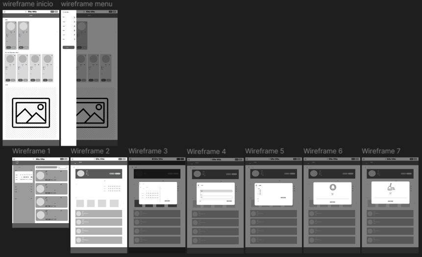
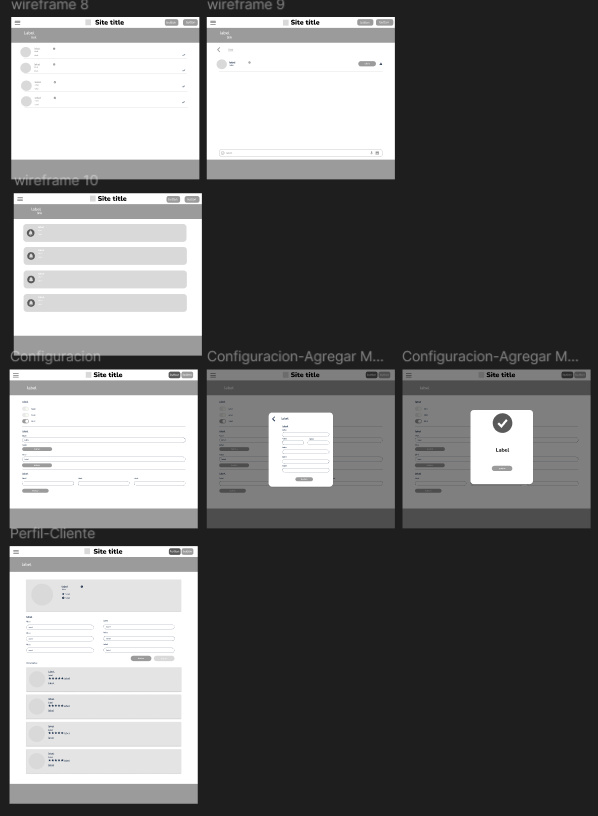

### 4.6. Domain-Driven Software Architecture

#### 4.6.1. Software Architecture Context Diagrams

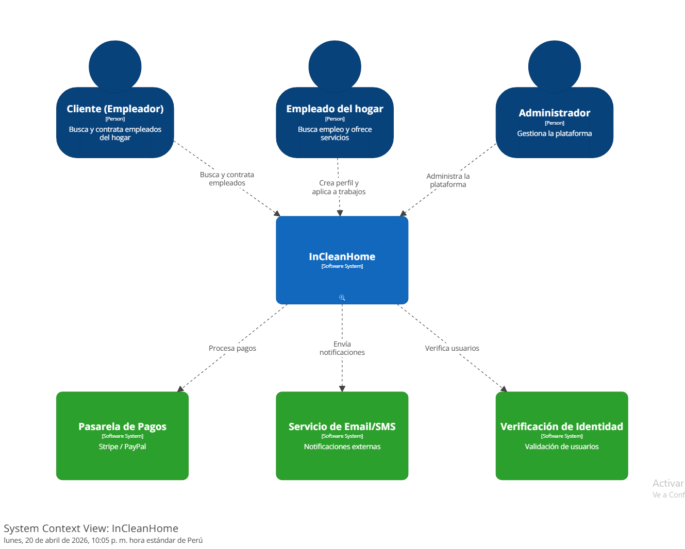

#### 4.6.2. Software Architecture Container Diagrams

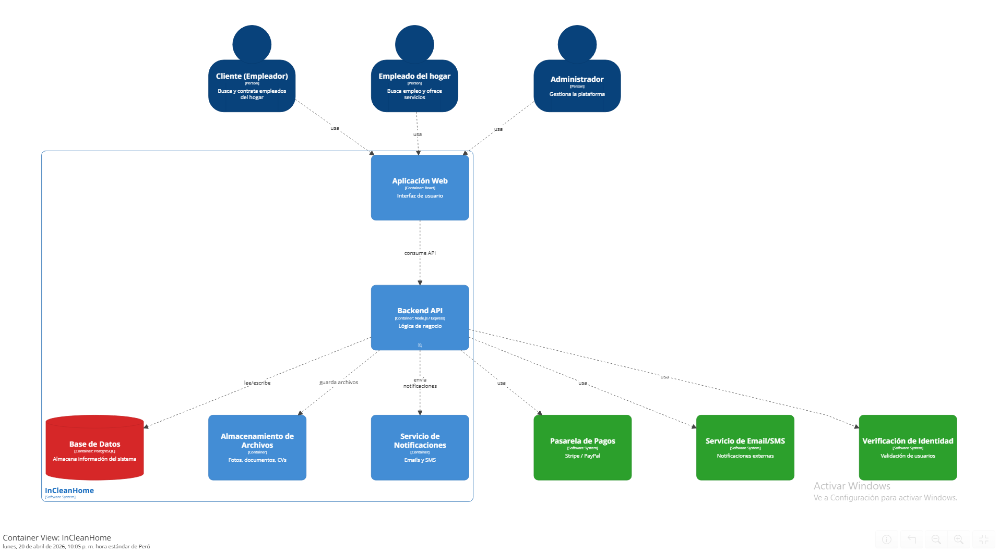

#### 4.6.3. Software Architecture Components Diagrams

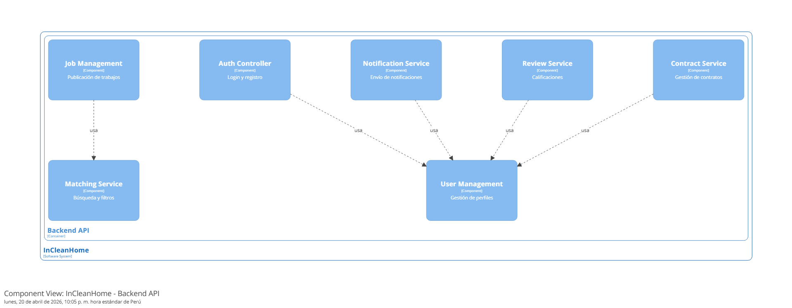

#### 4.7.1. Class Diagram

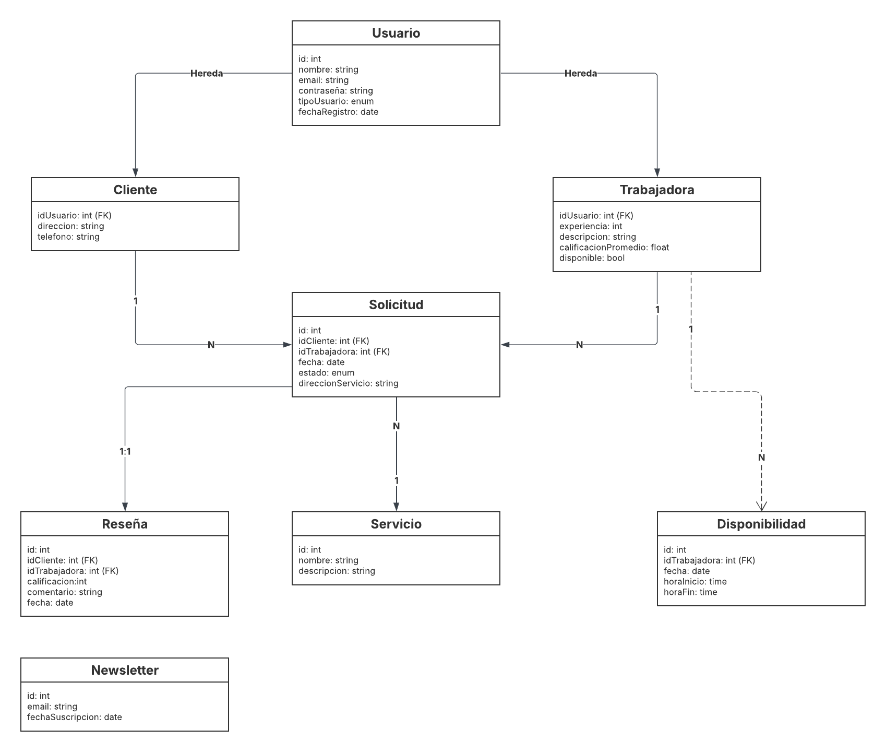

### 4.8. Database Design

#### 4.8.1. Database Diagram

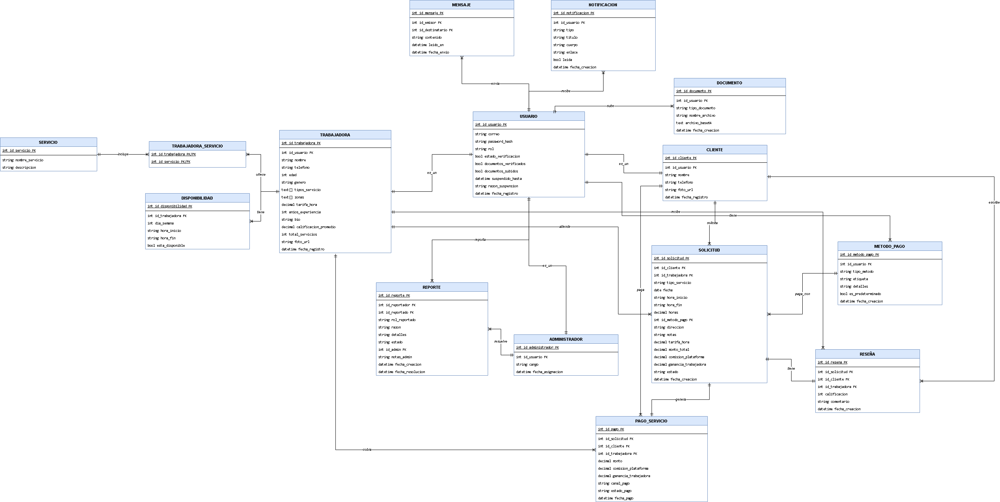

## Capítulo V: Product Implementation, Validation & Deployment

### 5.1. Software Configuration Management

 En esta sección, el equipo establece las decisiones y convenciones para mantener la consistencia durante el ciclo de vida del desarrollo del software. Estos procesos son cruciales para asegurar el uso adecuado de herramientas, el despliegue correcto y la aplicación de buenas prácticas en la codificación.

---

#### 5.1.1. Software Development Environment Configuration
 En esta sección se presentan las distintas herramientas utilizadas por el equipo para el desarrollo del proyecto **InCleanHome**.

##### UX/UI Design
- **UXPressia**: Utilizada para la creación de *User Persona*, *Empathy Maps*, *Journey Maps* e *Impact Maps*, permitiendo una mejor comprensión del usuario objetivo.
- **Figma**: Herramienta de diseño empleada para la creación de *wireframes* y *mockups* del sistema.
- **Miro**: Utilizada para la elaboración de *As-Is* y *To-Be Scenario Maps*, facilitando la planificación visual.

##### Software Development
- **Visual Studio Code**: Entorno de desarrollo para la implementación de la landing page usando HTML5, CSS, JavaScript y Vue.
- **Rider**: IDE utilizado para el desarrollo en C# con la plataforma .NET, especialmente para la creación de Web Services con ASP.NET.
- **GitHub**: Plataforma de alojamiento de repositorios para la gestión del código fuente.
- **Git**: Sistema de control de versiones para el seguimiento de cambios y trabajo colaborativo.

#####  Project Management & Collaboration
- **Lucidchart**: Herramienta para la creación de diagramas UML, *wireflows* y *user flows*.
- **Structurizr**: Utilizada para modelar la arquitectura mediante diagramas C4 (contexto, contenedores y componentes).

#####  Software Testing & Documentation
- **Markdown**: Lenguaje de marcado ligero utilizado para documentar el proyecto dentro del repositorio.

---
#### 5.1.2. Source Code Management
-La gestión del código fuente es fundamental en el desarrollo del proyecto, ya que permite registrar cambios, colaborar en equipo y recuperar versiones anteriores del código.

En **InCleanHome**, se utiliza:
- **Git** como sistema de control de versiones.
- **GitHub** como plataforma para alojar los repositorios.

#####  URL de los repositorios
- **Organización**: *https://github.com/upc-pre-1asi0730-12263-InCleanHome*
- **Project Report**: *https://github.com/upc-pre-1asi0730-12263-InCleanHome/incleanhome-report*
- **Landing Page**: *https://upc-pre-1asi0730-12263-incleanhome.github.io/InCleanHome-website/*

---

#### 5.1.3. Source Code Style Guide & Conventions
-Para el desarrollo del proyecto se establecieron normas que aseguran un código consistente, mantenible y fácil de entender. Estas convenciones se aplican en:

- **Landing Page**: HTML, CSS y JavaScript
- **Web Applications**: Vue + JavaScript
- **RESTful Web Services**: ASP.NET Core + C#

Algunas prácticas incluyen:
- Uso de nombres descriptivos para variables y funciones.
- Indentación consistente.
- Separación clara de responsabilidades (frontend/backend).
- Uso de comentarios cuando sea necesario.
- Aplicación de buenas prácticas según cada tecnología.

---
#### 5.1.4. Software Deployment Configuration
- En esta seccion se detalla la configuración necesaria para el despliegue de nuestra solución, incluyendo los pasos clave para lograr su publicación satisfactoria de la landing page, servicios web y aplicaiones frontend usando GitHub para poder verificar cada commit de la landing page.

Explicaremos los pasos para poder desplegar nuestra landing page.

- Verificamos que todas las ramas estan actualizadas.
- Dentro de la seccion settings buscamos la opcion pages, aqui podremos configurar el despliegue de la pagina desde una rama especifica del repositorio.
- Configuramos la rama o elegimos la rama principal (main o master), luego guardamos para iniciar el proceso de despliegue.
- Finalmente se podrá acceder a la pagina mediante el enlace que GitHub nos otorgará.

### 5.2. Landing Page, Services & Applications Implementation
En esta sección se describe el proceso de implementación del producto **InCleanHome**, considerando el avance correspondiente a la primera entrega del proyecto (AV1), enfocado principalmente en la construcción de la Landing Page y la documentación inicial.

---
#### 5.2.1. Sprint 1
El Sprint 1 estuvo orientado al desarrollo de la **Landing Page** y la consolidación de los artefactos de análisis y diseño del proyecto.

---
##### 5.2.1.1. Sprint Planning 1
**Sprint Goal:**
Desarrollar una Landing Page funcional que comunique la propuesta de valor del producto InCleanHome y refleje el diseño definido en los mockups.

**Duración del Sprint:**
2 semanas

**Alcance del Sprint:**
- Implementación de la Landing Page
- Estructura base del proyecto frontend
- Integración del diseño UX/UI previamente definido

**User Stories seleccionadas:**
- US01: Como visitante, deseo conocer el servicio para entender su propuesta de valor.
- US02: Como visitante, deseo navegar entre secciones para explorar el contenido.
- US03: Como visitante, deseo ver información clara y organizada para generar confianza.

**Tabla 17:** *Resumen ejecutivo del Sprint Planning 1.*

| Sprint # | Sprint 1 |
| :--- | :--- |
| **Sprint Planning Background** | Desarrollo de la Landing Page y consolidación de artefactos de análisis y diseño. |
| **Date** | 2026-04-23 |
| **Time** | 16:00 |
| **Location** | Server Report |
| **Prepared by** | Team Leader |
| **Attendees** | All members |
| **Sprint Review Summary** | Se implementó con éxito la estructura base del frontend, el diseño responsive y la propuesta de valor, cumpliendo con las 4 User Stories priorizadas. |
| **Sprint Goal** | Desarrollar una Landing Page funcional que comunique la propuesta de valor del producto InCleanHome y refleje el diseño definido en los mockups. |
| **Sprint Velocity** | 100% |
| **Sum of Story Points** | 4 US (US-L07, US-L08, US-L09, US-L10) |

---
##### 5.2.1.2. Aspect Leaders and Collaborators

**Tabla 18:** *Asignación de roles y responsabilidades en el repositorio para el Sprint 1.*

| Team Member | GitHub Username | Landing Page leader(L) collaborator(C)  |
| :--- | :--- | :--- |
| Garcia Cerpa, Braden Raid | BradenGarcia | C |
| Espino Rossi, Victor Manuel | Vmer140 | C |
| Vara Velasquez, Oscar Fernando | Varometro159 | C |
| Choy Robles, Vanessa May Lang | VMLCR | C |
| Valverde Portuguez, Natalia Ximena | NatValverde15 | L |

**Nota:**  
Debido al alcance del primer avance, todos los integrantes participaron en conjunto en las actividades de desarrollo y documentación.

---

##### 5.2.1.3. Sprint Backlog 1

El Sprint Backlog se definió a partir de las User Stories priorizadas en el Product Backlog.  
Cada historia fue descompuesta en tareas técnicas para facilitar su implementación y asignación dentro del equipo.

**Tabla 19:** *Sprint Backlog detallado para el Sprint 1.*

| US ID | User Story / Tareas Técnicas | Responsable | Estado |
| :--- | :--- | :--- | :--- |
| **US-L08** | **Visualización de propuesta de valor** | **Equipo** | **Completado** |
| | Diseñar sección "Features" en base a mockups | Equipo | Hecho |
| | Implementar estructura HTML | Equipo | Hecho |
| | Aplicar estilos CSS | Equipo | Hecho |
| | Ajustar diseño responsive | Equipo | Hecho |
| **US-L09** | **Consumo de testimonios** | **Equipo** | **Completado** |
| | Diseñar sección de testimonios | Equipo | Hecho |
| | Implementar cards de testimonios | Equipo | Hecho |
| | Aplicar estilos visuales | Equipo | Hecho |
| **US-L07** | **Suscripción a Newsletter** | **Equipo** | **Completado** |
| | Implementar input de correo en footer | Equipo | Hecho |
| | Validar formato de email (frontend) | Equipo | Hecho |
| | Diseñar sección footer | Equipo | Hecho |
| **US-L10** | **Adaptabilidad móvil** | **Equipo** | **Completado** |
| | Implementar menú hamburguesa | Equipo | Hecho |
| | Configurar estilos responsive | Equipo | Hecho |
| | Probar visualización en móviles | Equipo | Hecho |
---

###  Desglose por User Stories

**Tabla 20:** *Desglose de tareas técnicas: US-L08.*

#### US-L08: Visualización de propuesta de valor
| Tarea | Responsable |
|------|------------|
| Diseñar sección "Features" en base a mockups | Equipo |
| Implementar estructura HTML | Equipo |
| Aplicar estilos CSS | Equipo |
| Ajustar diseño responsive | Equipo |

---

**Tabla 21:** *Desglose de tareas técnicas: US-L09.*

####  US-L09: Consumo de testimonios
| Tarea | Responsable |
|------|------------|
| Diseñar sección de testimonios | Equipo |
| Implementar cards de testimonios | Equipo |
| Aplicar estilos visuales | Equipo |

---

**Tabla 22:** *Desglose de tareas técnicas: US-L07.*

####  US-L07: Suscripción a Newsletter
| Tarea | Responsable |
|------|------------|
| Implementar input de correo en footer | Equipo |
| Validar formato de email (frontend) | Equipo |
| Diseñar sección footer | Equipo |

---

**Tabla 23:** *Desglose de tareas técnicas: US-L10.*

####  US-L10: Adaptabilidad móvil
| Tarea | Responsable |
|------|------------|
| Implementar menú hamburguesa | Equipo |
| Configurar estilos responsive | Equipo |
| Probar visualización en móviles | Equipo |

---

###  EP-01 – Gestión de usuarios

**Tabla 24:** *Desglose de tareas técnicas: EP-01 (Gestión de usuarios).*

| USER STORY | TAREAS | RESPONSABLE |
|------------|---------|-------------|
| US-01 – Registro de cliente | Diseño del formulario de registro | Equipo |
|  | Validaciones frontend | Equipo |
| US-02 – Inicio de sesión cliente | Implementación del login UI | Equipo |
|  | Diseño responsive del login | Equipo |
| US-20 – Recuperar contraseña cliente | Diseño de pantalla recovery | Equipo |
|  | Inputs y validaciones | Equipo |

---

**Tabla 25:** *Desglose de tareas técnicas: EP-02 (Búsqueda y filtrado).*

###  EP-02 – Búsqueda y filtrado

| USER STORY | TAREAS | RESPONSABLE |
|------------|---------|-------------|
| US-04 – Filtrar por ubicación | Crear filtro visual de ubicación | Equipo |
| US-06 – Filtrar por habilidades | Implementar categorías y habilidades | Equipo |
| US-07 – Filtrar por disponibilidad | Crear filtros de horarios | Equipo |
| US-10 – Ordenar resultados | Implementar opciones de ordenamiento | Equipo |

---

**Tabla 26:** *Desglose de tareas técnicas: EP-03 (Perfiles y reseñas).*

###  EP-03 – Perfiles y reseñas

| USER STORY | TAREAS | RESPONSABLE |
|------------|---------|-------------|
| US-05 – Ver perfiles | Diseño de cards de perfiles | Equipo |
|  | Responsive design | Equipo |
| US-09 – Ver reseñas | Implementar sección de reseñas | Equipo |
| US-14 – Calificar servicio | Diseño de componente rating | Equipo |

---

###  EP-04 – Contratación y pagos

**Tabla 27:** *Desglose de tareas técnicas: EP-04 (Contratación y pagos).*

| USER STORY | TAREAS | RESPONSABLE |
|------------|---------|-------------|
| US-08 – Contratar servicio | Diseño de formulario contratación | Equipo |
| US-11 – Método de pago | Diseño visual de pagos | Equipo |

---

###  EP-05 – Comunicación y notificaciones

**Tabla 28:** *Desglose de tareas técnicas: EP-05 (Comunicación y notificaciones).*

| USER STORY | TAREAS | RESPONSABLE |
|------------|---------|-------------|
| US-13 – Mensajería cliente | Diseño interfaz de mensajería | Equipo |
| US-18 – Notificaciones cliente | Implementación panel notificaciones | Equipo |

---

###  EP-06 – Gestión de disponibilidad

**Tabla 29:** *Desglose de tareas técnicas: EP-06 (Gestión de disponibilidad).*

| USER STORY | TAREAS | RESPONSABLE |
|------------|---------|-------------|
| US-26 – Gestión de disponibilidad | Implementación calendario frontend | Equipo |
|  | Diseño responsive del calendario | Equipo |

###  Resumen del Sprint Backlog

**Tabla 30:** *Estado final de las User Stories del Sprint 1.*

| ID | User Story | Estado |
|----|-----------|--------|
| US-L07 | Newsletter | Completado |
| US-L08 | Propuesta de valor | Completado |
| US-L09 | Testimonios | Completado |
| US-L10 | Adaptabilidad móvil | Completado |

---

##### 5.2.1.4. Development Evidence for Sprint Review

Durante el Sprint 1 se desarrolló la Landing Page basada en los diseños definidos previamente.

**Incluye:**
- Estructura HTML de la página
- Estilos CSS para el diseño visual
- Componentes básicos de la interfaz
- Capturas de código

- Link al repositorio GitHub: https://github.com/upc-pre-1asi0730-12263-InCleanHome 
- Historial de commits
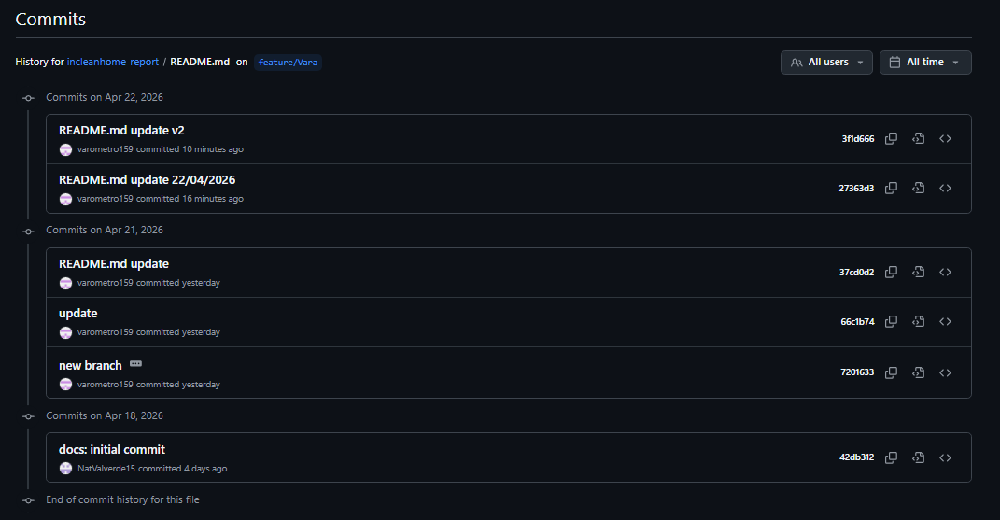
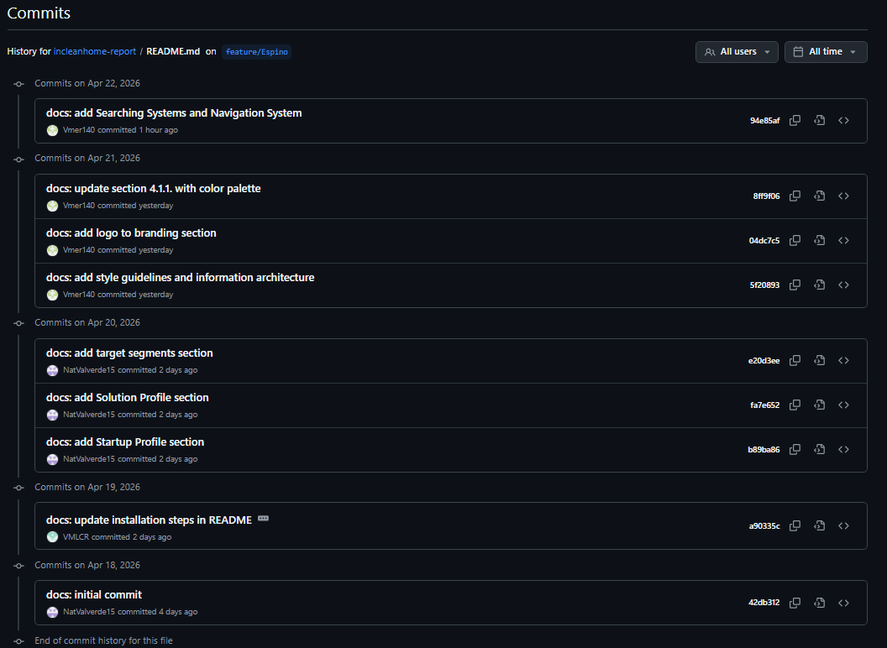
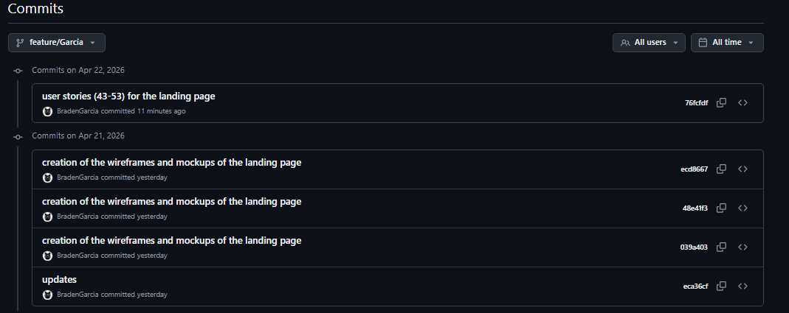
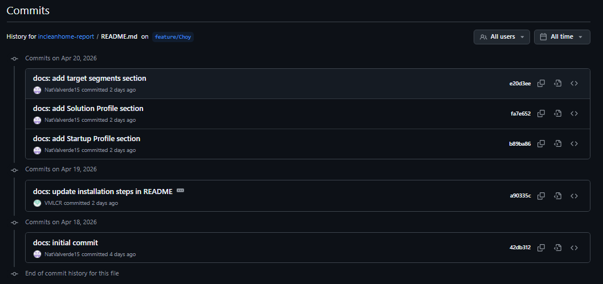

---
##### 5.2.1.5. Execution Evidence for Sprint Review

Se realizaron pruebas básicas de ejecución en navegador para validar el funcionamiento de la Landing Page.

**Validaciones realizadas:**
- Correcta visualización de secciones
- Navegación fluida
- Diseño responsive 

- Screenshots de la página en ejecución

---
##### 5.2.1.6. Services Documentation Evidence for Sprint Review

En este sprint **no se implementaron servicios backend**, ya que el enfoque estuvo en la Landing Page.

Sin embargo, se definieron de manera preliminar:
- Posibles endpoints del sistema
- Estructura futura de los servicios REST

Esto servirá como base para los siguientes sprints.

---

##### 5.2.1.7. Software Deployment Evidence for Sprint Review

Se realizó una ejecución local de la Landing Page para validación.

**Estado:**
- Aplicación funcional en entorno local

- Link de despliegue: 

---
##### 5.2.1.8. Team Collaboration Insights during Sprint

Durante el Sprint 1, el equipo trabajó de forma colaborativa en el desarrollo de la Landing Page y la documentación del proyecto.

**Aspectos positivos:**
- Trabajo conjunto en el desarrollo frontend
- Organización para completar la documentación requerida
- Uso de GitHub para control de versiones

**Aspectos a mejorar:**
- Mejor distribución de tareas
- Mayor planificación del tiempo
- Incrementar la frecuencia de commits

**Conclusión:**
El equipo logró cumplir con los objetivos del Sprint 1, estableciendo una base sólida del proyecto mediante la implementación de la Landing Page y la documentación necesaria para el avance.

#### 5.2.2 Sprint 2

##### 5.2.2.1.Sprint Planning 2.
**Sprint Goal:**
Desarrollar el frontend de la futura web app siguiendo los diseños establecidos en el figma. 

**Duración del Sprint:**
2 semanas

**Alcance del Sprint:**
- Implementación del frontend de la webb application
- Estructura base del proyecto frontend
- Integración del diseño UX/UI previamente definido

**Tabla 31:** *Resumen ejecutivo del Sprint Planning 2.*

| Sprint # | Sprint 2 |
| :--- | :--- |
| **Sprint Planning Background** | Desarrollo del front de la webb app y el modelo de negocio a travez de la implementacion de los bounded context |
| **Date** | 2026-05-12 |
| **Time** | 16:00 |
| **Location** | Server Report |
| **Prepared by** | Team Leader |
| **Attendees** | All members |
| **Sprint Review Summary** | Se implementó con éxito la estructura base del frontend, el diseño responsive y la propuesta de valor, cumpliendo con las 4 User Stories priorizadas. |
| **Sprint Goal** | Desarrollar una webb app siguiendo una arquitectura de negocio usando los bounded contexts correctos para esta implementacion |
| **Sprint Velocity** | 100% |
| **Sum of Story Points** | EP 1-2-3-4-5-6 |
----

##### 5.2.2.2. Aspect Leaders and Collaborators.

**Tabla 32:** *Asignación de roles y responsabilidades en el repositorio para el Sprint 2.*

| Team Member | GitHub Username | web app implementation leader(L) collaborator(C)  |
| :--- | :--- | :--- |
| Garcia Cerpa, Braden Raid | BradenGarcia | C |
| Espino Rossi, Victor Manuel | Vmer140 | C |
| Vara Velasquez, Oscar Fernando | Varometro159 | C |
| Choy Robles, Vanessa May Lang | VMLCR | C |
| Valverde Portuguez, Natalia Ximena | NatValverde15 | L |

---
##### 5.2.2.3.Sprint Backlog 2.

**Tabla 33:** *Sprint Backlog detallado para el Sprint 2.*

| USER STORY | TÍTULO | DESCRIPCIÓN | ESTIMACIÓN HORAS | ASSIGNED TO | ESTADO |
|------------|---------|-------------|------------------|-------------|--------|
| US-01 | Registro de cliente | Implementación de la interfaz frontend para el registro de clientes en la plataforma. | 6 h | Equipo | DONE |
| US-02 | Inicio de sesión cliente | Desarrollo del formulario de inicio de sesión para clientes. | 5 h | Equipo | DONE |
| US-20 | Recuperar contraseña cliente | Diseño e implementación de la pantalla de recuperación de contraseña. | 4 h | Equipo | DONE |
| US-04 | Filtrar por ubicación | Implementación de filtros visuales por ubicación en la búsqueda de trabajadoras. | 5 h | Equipo | DONE |
| US-06 | Filtrar por habilidades | Desarrollo de filtros frontend por habilidades de trabajadoras. | 4 h | Equipo | DONE |
| US-07 | Filtrar por disponibilidad | Implementación de filtros por disponibilidad y horarios. | 4 h | Equipo | DONE |
| US-10 | Ordenar resultados | Implementación de opciones de ordenamiento visual de resultados. | 3 h | Equipo | DONE |
| US-05 | Ver perfiles | Desarrollo de interfaz de visualización de perfiles de trabajadoras. | 6 h | Equipo | DONE |
| US-09 | Ver reseñas | Implementación de sección de reseñas y calificaciones de usuarios. | 4 h | Equipo | DONE |
| US-14 | Calificar servicio | Desarrollo del componente frontend para registrar calificaciones. | 3 h | Equipo | DONE |
| US-08 | Contratar servicio | Diseño de formulario frontend para contratación de servicios. | 6 h | Equipo | DONE |
| US-11 | Método de pago | Implementación visual de selección de métodos de pago. | 4 h | Equipo | DONE |
| US-13 | Mensajería cliente | Diseño de interfaz de chat/mensajería entre cliente y trabajadora. | 5 h | Equipo | DONE |
| US-18 | Notificaciones cliente | Implementación visual de panel de notificaciones frontend. | 4 h | Equipo | DONE |
| US-26 | Gestión de disponibilidad | Desarrollo de interfaz para configuración de disponibilidad de trabajadoras. | 5 h | Equipo | DONE |

##### 5.2.2.4.Development Evidence for Sprint Review.

**Tabla 34:** *Registro de commits y evidencia de integración continua (CI) en GitHub.*

| Repository | Branch | Commit Id | Commit Message | Commit Message Body | Commited |
|------------|--------|-----------|----------------|----------------------|----------|
|   InCleanHome-frontend         |  feature/Vara      |  aab006a         |  feat(booking): setup booking domain structure and initial components              |                      |      09/05/2026    |
|   InCleanHome-frontend         | feature/Garcia       |  2281bb4         |      feat: implement Search-and-catalog bounded context          |                      |   11/05/2026       |
|    InCleanHome-frontend        |feature/Espino        |     a9cee57      |    feat: implement Search-and-catalog bounded context            |                      |    09/05/2026      |
InCleanHome-frontend        | feature/natalia       |    0c2c1c      |     feat: update files in User-management bounded context(student:Natalia Valverde)           |                      |     12/05/2026     |
InCleanHome-frontend        | feature/Choy       |   db27b67      | feat: feat payments and shared               |                      | 11/05/2026         |
##### 5.2.2.5.Execution Evidence for Sprint Review.

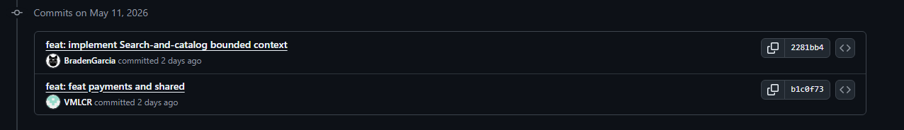

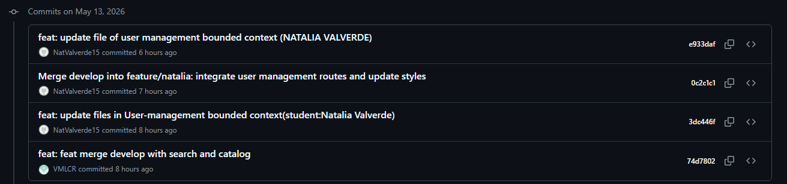
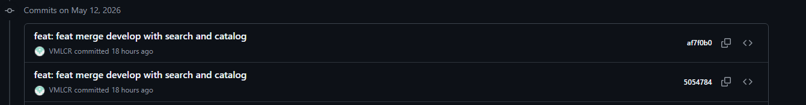

##### 5.2.2.6.Services Documentation Evidence for Sprint Review.

En este sprint **no se implementaron servicios backend**, ya que el enfoque estuvo en el desarrollo frontend de la web app.

Sin embargo, se definieron de manera preliminar:
- Posibles endpoints del sistema
- Estructura futura de los servicios REST

Esto servirá como base para los siguientes sprints.
##### 5.2.2.7.Software Deployment Evidence for Sprint Review.

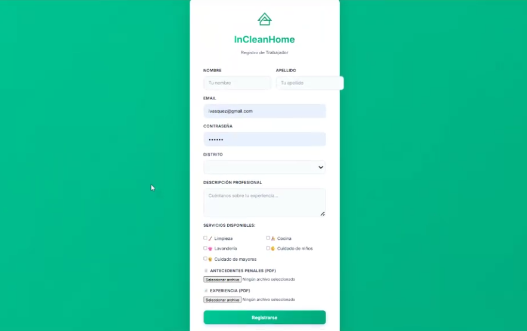
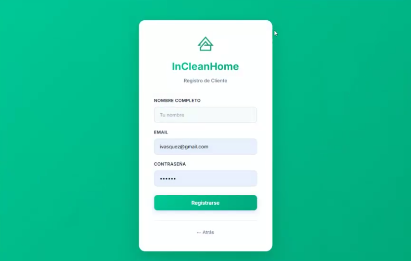
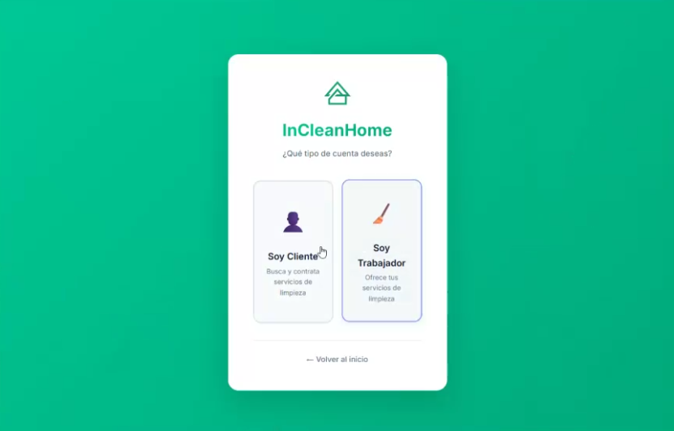
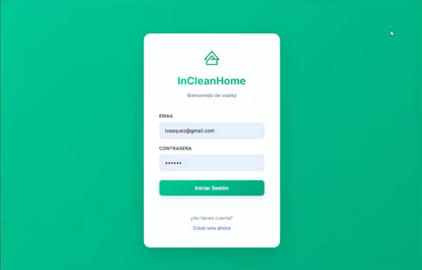
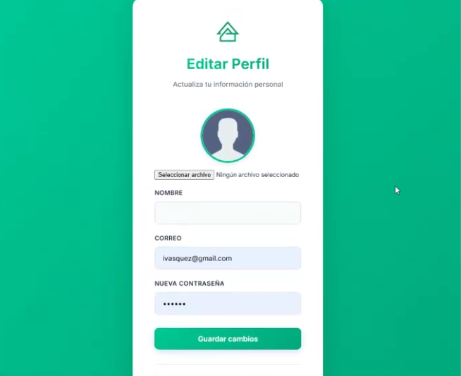
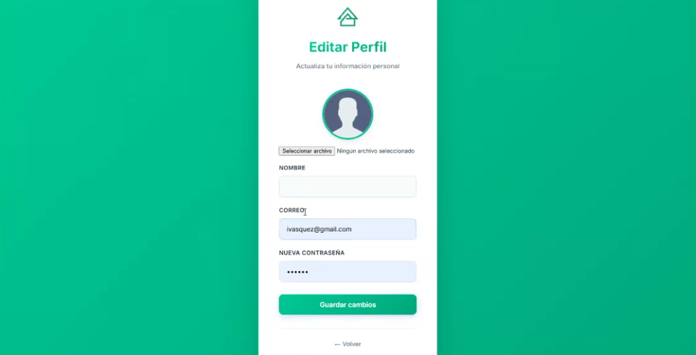
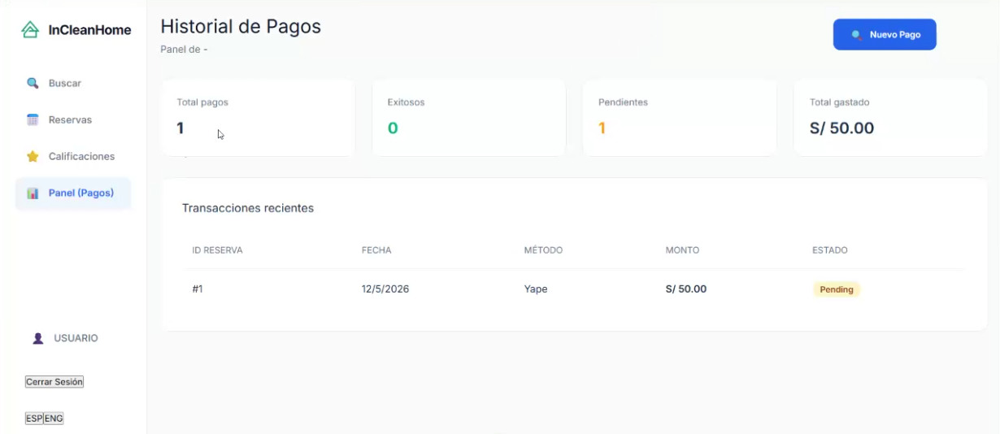
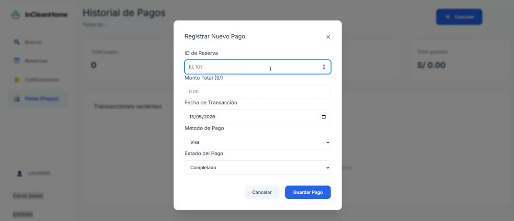
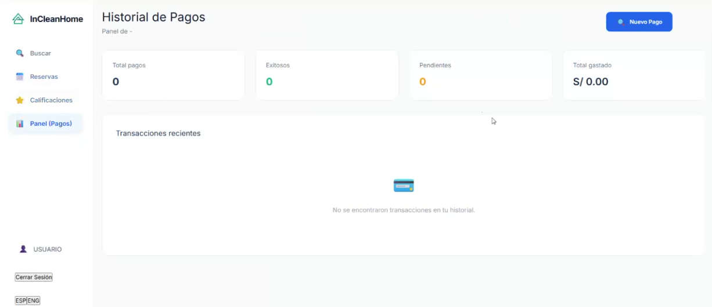
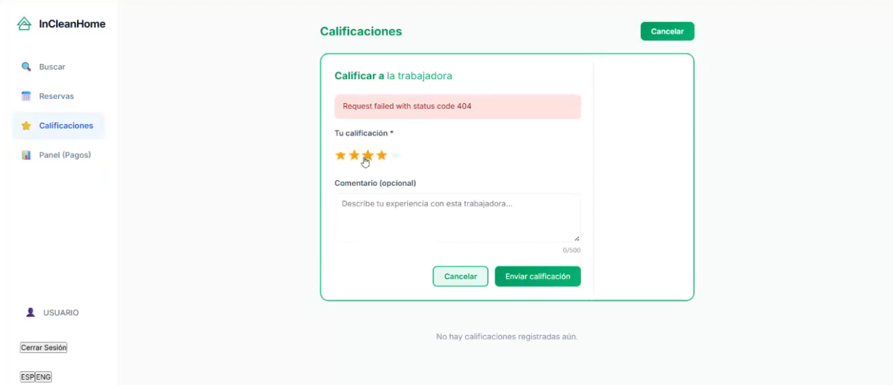
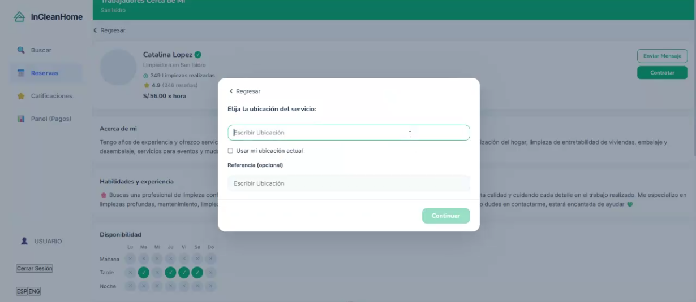
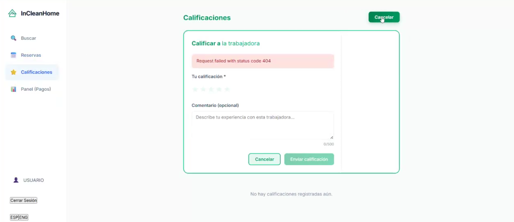
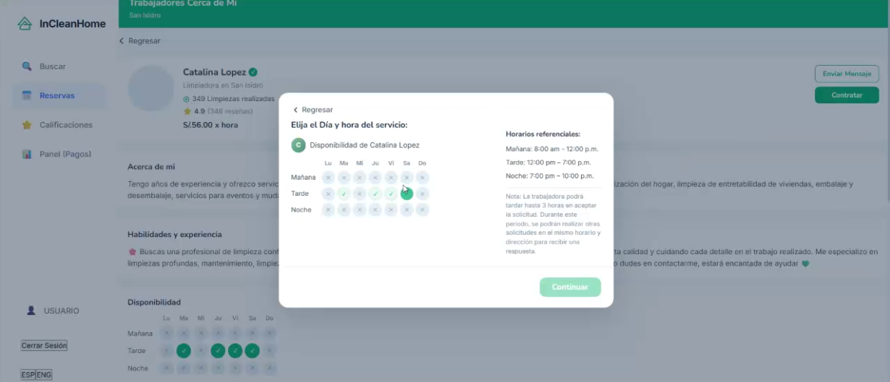
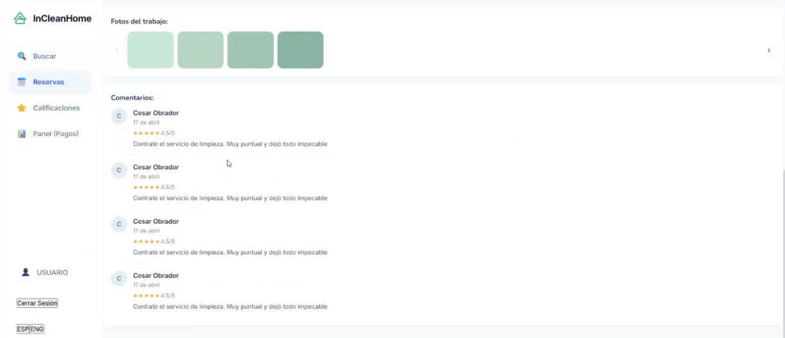
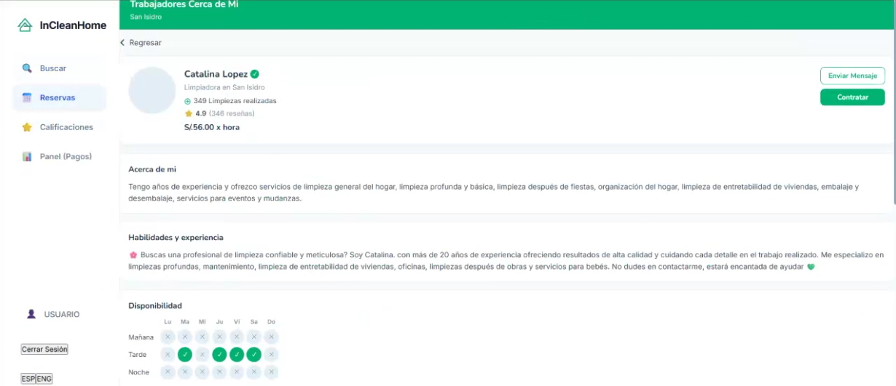
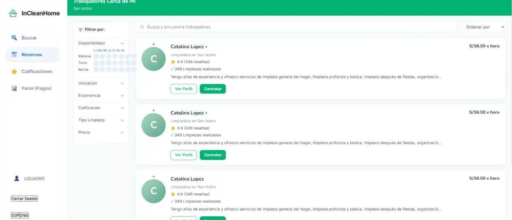
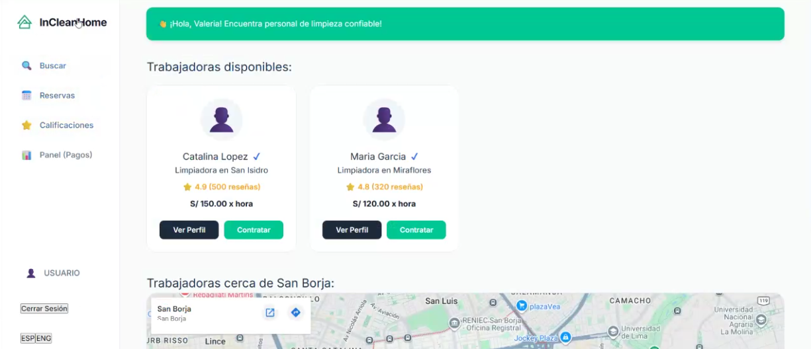
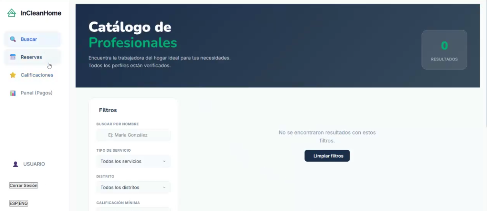

##### 5.2.2.8.Team Collaboration Insights during Sprint.

Durante el Sprint 2, el equipo trabajó de forma colaborativa en el desarrollo de la web app y la documentación del proyecto.

**Aspectos positivos:**
- Trabajo conjunto en el desarrollo de la web app siguiendo el modelo de negocio
- Organización para completar la documentación requerida
- Uso de GitHub para control de versiones

**Aspectos a mejorar:**
- Mejor distribución de tareas
- Mayor planificación del tiempo
- Incrementar la frecuencia de commits

**Conclusión:**
El equipo logró cumplir con los objetivos del Sprint 2, estableciendo un gran avance en el desarrollo de la web app incluyendo el modelo de negocio y siguiendo buenas practicas en la arquitectura del proyecto.

#### 5.2.3 Sprint 3

##### 5.2.3.1.Sprint Planning 3.
**Sprint Goal:**
Desarrollar el backend del proyecto y desplegar en producción el frontend y el backend usando las tecnologias correspondientes.

**Duración del Sprint:**
2 semanas

**Alcance del Sprint:**
- Implementar el backend de la solucion del proyecto.
- Crear una api con los endpoints correspondientes.
- Integración del diseño UX/UI previamente definido

##### 5.2.3.2. Aspect Leaders and Collaborators.

##### 5.2.3.3.Sprint Backlog 3.
| USER STORY | TÍTULO | DESCRIPCIÓN | ESTIMACIÓN HORAS | ASSIGNED TO | ESTADO |
|------------|---------|-------------|------------------|-------------|--------|
| US-01 | Registro de cliente | Implementación del endpoint de registro de clientes (`POST /api/auth/register/client`) en el backend. |  |  | DONE |
| US-02 | Inicio de sesión cliente | Desarrollo del endpoint de autenticación y generación de token JWT (`POST /api/auth/login`). |  |  | DONE |
| US-03 | Registro de trabajadora | Implementación del endpoint de registro de trabajadoras del hogar (`POST /api/auth/register/worker`). |  |  | DONE |
| US-XX | Carga de documentos de trabajadora | Desarrollo del endpoint para la subida de documentos de verificación de trabajadoras (`POST /api/auth/worker/upload-document`). |  |  | DONE |
| US-04 | Filtrar por ubicación | Implementación del endpoint de búsqueda y filtrado de trabajadoras (`GET /api/workers`) en el bounded context Search and Catalog. |  |  | DONE |
| US-05 | Ver perfiles | Desarrollo del endpoint de consulta de perfil de trabajadora por id (`GET /api/workers/{id}`). |  |  | DONE |
| US-26 | Gestión de disponibilidad | Implementación de los endpoints de consulta y actualización de disponibilidad de trabajadoras (`GET` y `PUT /api/workers/{id}/availability`). |  |  | DONE |
| US-XX | Perfil propio de trabajadora | Desarrollo de los endpoints para que la trabajadora consulte y actualice su propio perfil (`GET` y `PUT /api/workers/me/profile`). |  |  | DONE |
| US-XX | Estadísticas de trabajadora | Implementación del endpoint de estadísticas del perfil de trabajadora (`GET /api/workers/me/stats`). |  |  | DONE |
| US-XX | Perfil de cliente | Desarrollo de los endpoints para consultar y actualizar el perfil del cliente (`GET` y `PATCH /api/my-profile`). |  |  | DONE |
| US-08 | Contratar servicio | Implementación del endpoint de creación de reservas/contratación de servicio (`POST /api/bookings`). |  |  | DONE |
| US-XX | Listar reservas | Desarrollo del endpoint de listado de reservas del usuario autenticado (`GET /api/bookings`). |  |  | DONE |
| US-XX | Actualizar estado de reserva | Implementación del endpoint para actualizar el estado de una reserva (`PATCH /api/bookings/{id}/status`). |  |  | DONE |
| US-11 | Método de pago | Desarrollo de los endpoints de registro, listado, selección de método predeterminado y eliminación de métodos de pago (`GET`, `POST`, `PATCH`, `DELETE /api/payments/methods`). |  |  | DONE |
| US-13 | Mensajería cliente | Implementación de los endpoints de mensajería: listado de conversaciones, hilo de mensajes y envío de mensajes (`GET /api/messages/conversations`, `GET` y `POST /api/messages/{userId}`). |  |  | DONE |
| US-14 | Calificar servicio | Desarrollo de los endpoints de creación de reseñas y consulta de reseñas por trabajadora (`POST /api/reviews`, `GET /api/reviews/worker/{id}`). |  |  | DONE |
| US-XX | Documentación de la API | Configuración e implementación de Swagger/OpenAPI para la documentación interactiva de todos los endpoints del backend. |  |  | DONE |
| US-XX | Despliegue del backend | Configuración del backend para despliegue en producción (Dockerfile, render.yaml). |  |  |  |

##### 5.2.3.4.Development Evidence for Sprint Review.

| Repository | Branch | Commit Id | Commit Message | Commit Message Body | Commited |
|------------|--------|-----------|----------------|----------------------|----------|
| InCleanHome-Backend | feature |  7693527| feat:new frontend version |  -| 18/06/2026 |
| InCleanHome-Backend | feature | 6e5dbd2 | fixed BookingRequestCommands |  -|  18/06/2026|
| InCleanHome-Backend | feature | d557fd0 | feat: Update MessagingResources.cs |-  |  18/06/2026|
| InCleanHome-Backend | feature | ac92ae6 | chore:InCleanHome backend with DDD bounded contexts
 | - |  18/06/2026|
| InCleanHome-Backend | feature | 4b805cd |fix: fix UserCommandService
  | - | 18/06/2026 |
##### 5.2.3.5.Execution Evidence for Sprint Review.
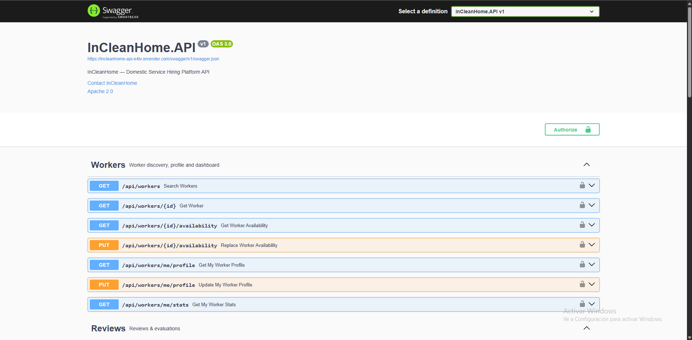
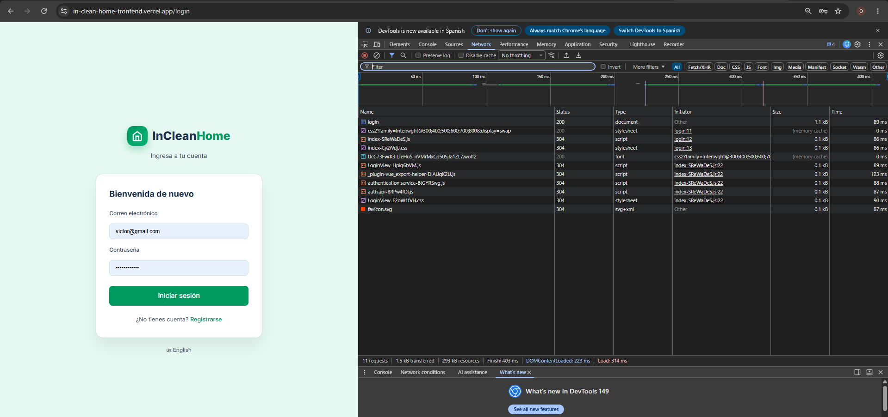
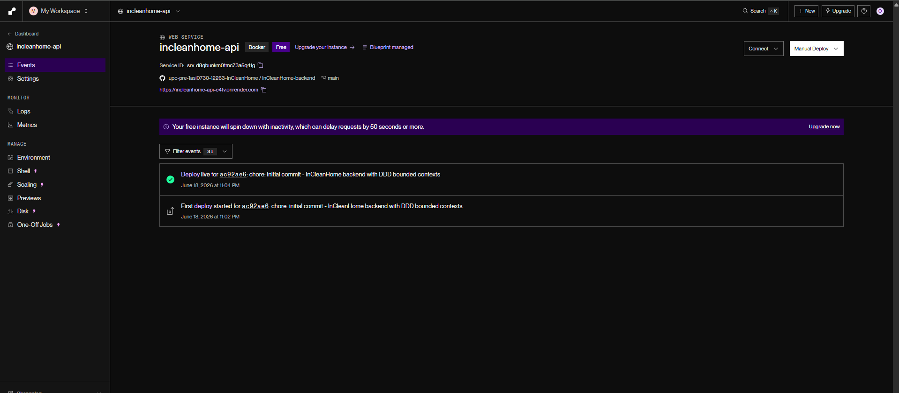
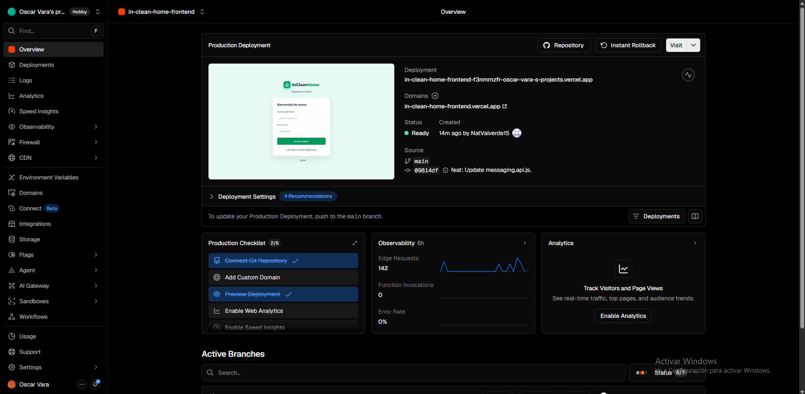

##### 5.2.3.6.Services Documentation Evidence for Sprint Review.
Durante el Sprint 3 se implementó el **backend completo** de la plataforma InCleanHome, estructurado siguiendo una arquitectura por **bounded contexts** (Domain-Driven Design), utilizando ASP.NET Core, Entity Framework Core y PostgreSQL.

Los bounded contexts implementados fueron:

- **IAM (Identity and Access Management):** gestión de autenticación, registro de clientes y trabajadoras, y carga de documentos de verificación.
- **Profiles:** gestión del perfil del cliente.
- **SearchAndCatalog:** búsqueda y filtrado de trabajadoras, gestión de perfil y disponibilidad de la trabajadora.
- **Booking:** creación, listado y actualización del estado de las reservas de servicio.
- **Payments:** registro y gestión de métodos de pago.
- **Messaging:** mensajería entre cliente y trabajadora.
- **ReviewsAndEvaluation:** registro y consulta de reseñas y calificaciones.

**Endpoints documentados (Swagger / OpenAPI):**

**Tabla 38:** *Endpoints REST implementados en el Sprint 3.*

| Bounded Context | Método | Endpoint | Descripción |
|---|---|---|---|
| IAM | POST | `/api/auth/login` | Inicio de sesión y generación de token JWT. |
| IAM | POST | `/api/auth/register/client` | Registro de un nuevo cliente. |
| IAM | POST | `/api/auth/register/worker` | Registro de una nueva trabajadora. |
| IAM | POST | `/api/auth/worker/upload-document` | Carga de documentos de verificación de la trabajadora. |
| Profiles | GET | `/api/my-profile` | Consulta del perfil del cliente autenticado. |
| Profiles | PATCH | `/api/my-profile` | Actualización del perfil del cliente autenticado. |
| SearchAndCatalog | GET | `/api/workers` | Búsqueda y filtrado de trabajadoras. |
| SearchAndCatalog | GET | `/api/workers/{id}` | Consulta del perfil público de una trabajadora. |
| SearchAndCatalog | GET | `/api/workers/{id}/availability` | Consulta de disponibilidad de una trabajadora. |
| SearchAndCatalog | PUT | `/api/workers/{id}/availability` | Actualización de disponibilidad de una trabajadora. |
| SearchAndCatalog | GET | `/api/workers/me/profile` | Consulta del propio perfil de la trabajadora autenticada. |
| SearchAndCatalog | PUT | `/api/workers/me/profile` | Actualización del propio perfil de la trabajadora autenticada. |
| SearchAndCatalog | GET | `/api/workers/me/stats` | Consulta de estadísticas de la trabajadora autenticada. |
| Booking | POST | `/api/bookings` | Creación de una nueva reserva/contratación. |
| Booking | GET | `/api/bookings` | Listado de reservas del usuario autenticado. |
| Booking | PATCH | `/api/bookings/{id}/status` | Actualización del estado de una reserva. |
| Payments | GET | `/api/payments/methods` | Listado de métodos de pago del usuario autenticado. |
| Payments | POST | `/api/payments/methods` | Registro de un nuevo método de pago. |
| Payments | PATCH | `/api/payments/methods/{id}/default` | Marcar un método de pago como predeterminado. |
| Payments | DELETE | `/api/payments/methods/{id}` | Eliminación de un método de pago. |
| Messaging | GET | `/api/messages/conversations` | Listado de conversaciones del usuario autenticado. |
| Messaging | GET | `/api/messages/{userId}` | Consulta del hilo de mensajes con un usuario específico. |
| Messaging | POST | `/api/messages/{userId}` | Envío de un mensaje a un usuario específico. |
| ReviewsAndEvaluation | POST | `/api/reviews` | Creación de una nueva reseña. |
| ReviewsAndEvaluation | GET | `/api/reviews/worker/{id}` | Consulta de reseñas de una trabajadora específica. |

La autenticación de los endpoints protegidos se realiza mediante **JWT (JSON Web Tokens)**, enviando el token en la cabecera `Authorization: Bearer <token>`. El hashing de contraseñas se implementó utilizando **BCrypt**.
##### 5.2.3.7.Software Deployment Evidence for Sprint Review.

**Vista cliente:**
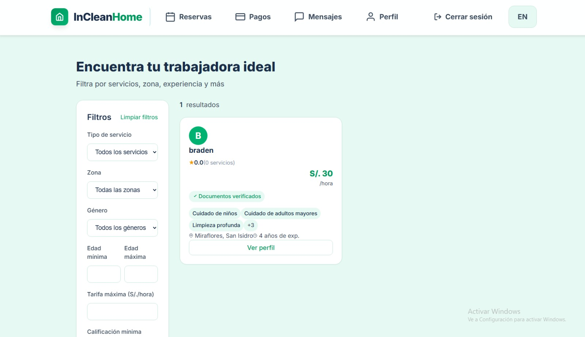
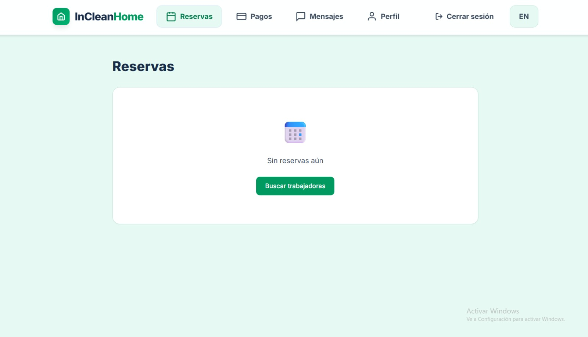
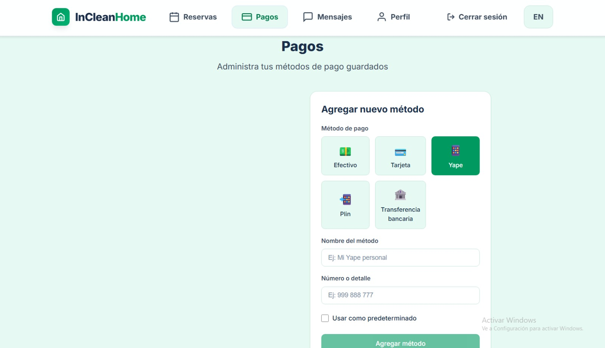
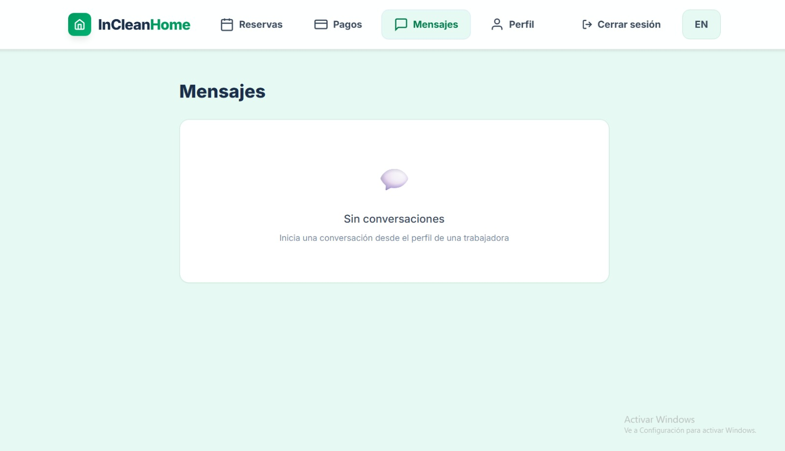
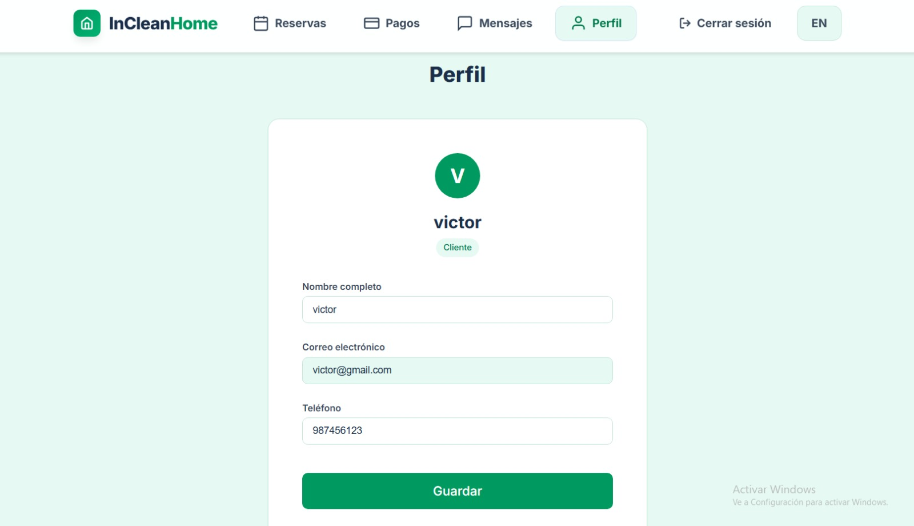

**Vista trabajadora:**
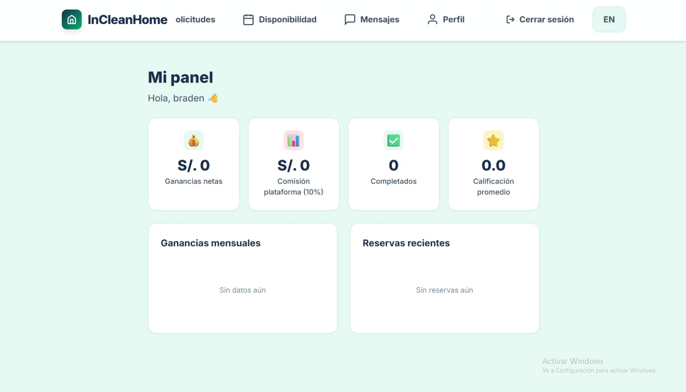
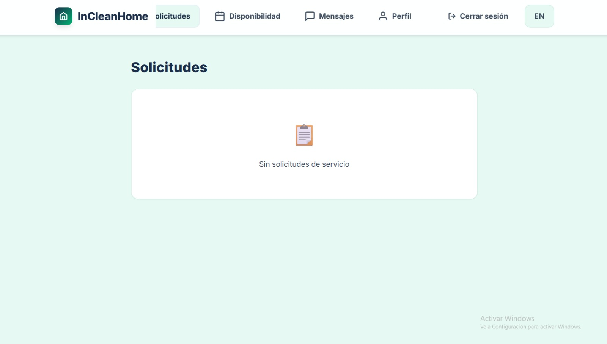
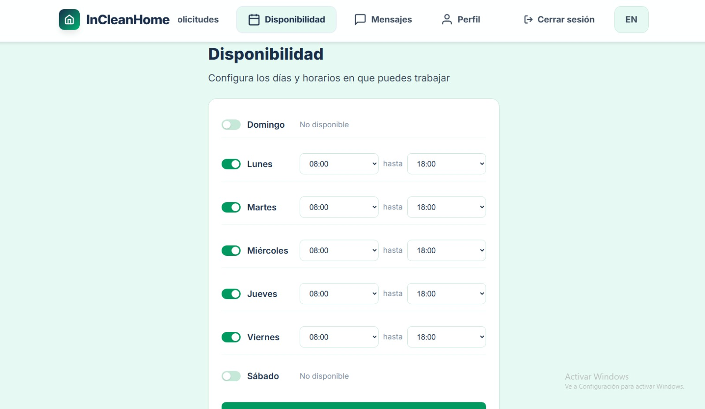
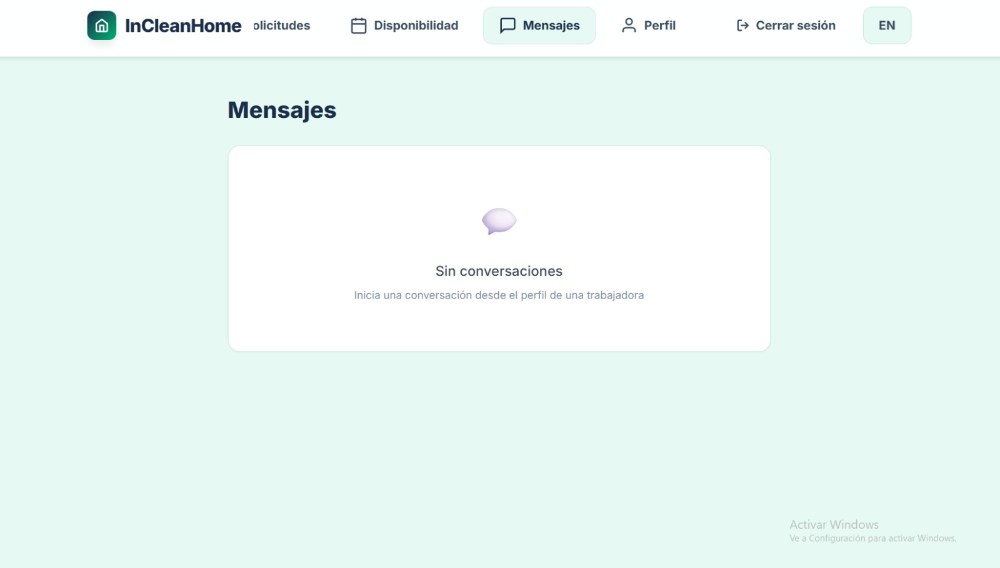
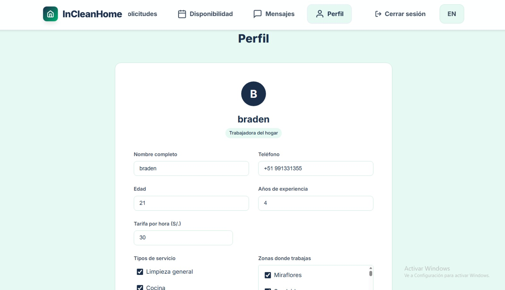

**Login:**
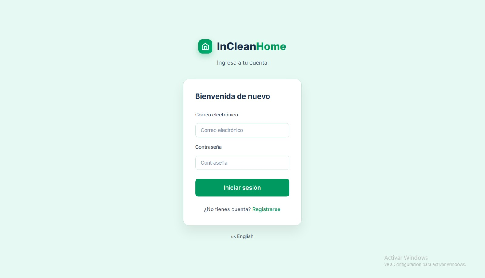

**Register:**
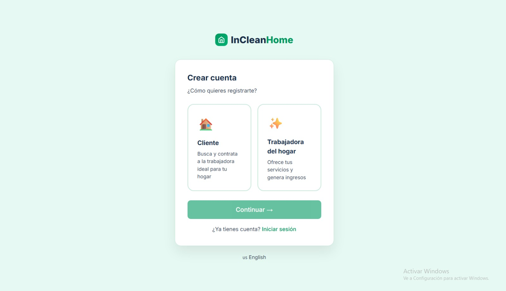
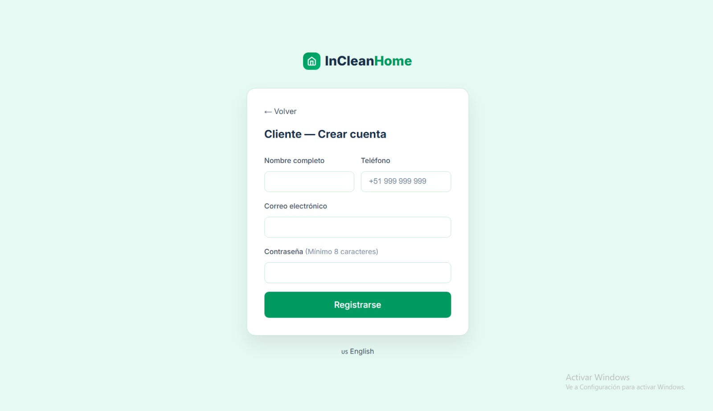
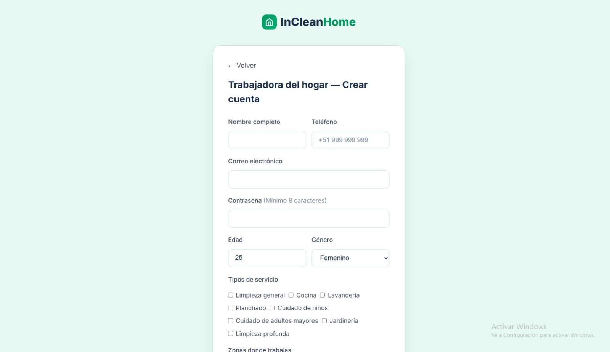

##### 5.2.3.8.Team Collaboration Insights during Sprint.
 Durante el Sprint 3, el equipo se enfocó en el desarrollo del backend de la plataforma, implementando la arquitectura por bounded contexts y exponiendo los servicios REST necesarios para dar soporte al frontend previamente desarrollado.

**Aspectos positivos:**
- Implementación de una arquitectura backend organizada por bounded contexts siguiendo buenas prácticas de DDD
- Documentación de los endpoints mediante Swagger/OpenAPI
- Integración de autenticación y autorización mediante JWT

**Conclusión:**
El equipo logró cumplir con los objetivos del Sprint 3, completando la implementación del backend de la plataforma InCleanHome y dejando el sistema listo para su despliegue en producción.
#### 5.2.4 Sprint 4
##### 5.2.4.1 Sprint Planning 4

Sprint Goal:
Completar la integración del sistema, corregir incidencias finales, optimizar la aplicación y preparar la versión final para la entrega del proyecto.

Duración del Sprint:
2 semanas

Alcance del Sprint:

Integración completa entre frontend y backend.
Corrección de errores detectados.
Optimización del rendimiento.
Validación funcional del sistema.
Documentación final.
Despliegue definitivo.
Tabla 39. Resumen ejecutivo del Sprint Planning 4
Sprint #	Sprint 4
Sprint Planning Background	Finalización del proyecto mediante integración completa, pruebas y despliegue definitivo.
Date	2026-06-30
Time	16:00
Location	Server Report
Prepared by	Team Leader
Attendees	All members
Sprint Review Summary	Se integró completamente el frontend con el backend, se corrigieron errores y se realizó el despliegue final del sistema.
Sprint Goal	Entregar una versión estable, funcional y documentada del sistema InCleanHome.
Sprint Velocity	100%
Sum of Story Points	Correcciones finales + Integración + Deployment

##### 5.2.4.2 Aspect Leaders and Collaborators
Tabla 40. Roles del Sprint 4
Team Member	GitHub Username	Integration Leader (L) / Collaborator (C)
Garcia Cerpa, Braden Raid	BradenGarcia	C
Espino Rossi, Victor Manuel	Vmer140	C
Vara Velasquez, Oscar Fernando	Varometro159	C
Choy Robles, Vanessa May Lang	VMLCR	C
Valverde Portuguez, Natalia Ximena	NatValverde15	L
5.2.4.3 Sprint Backlog 4
Tabla 41. Sprint Backlog
USER STORY	TÍTULO	DESCRIPCIÓN	ESTADO
US-40	Integración Frontend-Backend	Conectar completamente la interfaz con los servicios REST.	DONE
US-41	Corrección de Bugs	Resolver errores encontrados durante las pruebas funcionales.	DONE
US-42	Optimización	Mejorar tiempos de carga y rendimiento del sistema.	DONE
US-43	Validación Final	Ejecutar pruebas funcionales de todos los módulos.	DONE
US-44	Documentación Final	Actualizar documentación técnica y manual de usuario.	DONE
US-45	Despliegue Final	Publicación de la versión estable del sistema.	DONE
5.2.4.4 Development Evidence for Sprint Review
Tabla 42. Evidencia de desarrollo
Repository	Branch	Commit Message	Commited
InCleanHome-Frontend	main	fix: frontend integration with backend services	28/06/2026
InCleanHome-Backend	main	fix: resolve authentication issues	29/06/2026
InCleanHome-Backend	main	refactor: optimize API responses	29/06/2026
InCleanHome-Frontend	main	feat: final UI improvements	30/06/2026
InCleanHome	main	docs: update final project documentation	30/06/2026

##### 5.2.4.5 Execution Evidence for Sprint Review

Durante este Sprint se realizaron pruebas completas del sistema integrado.

Evidencias incluidas:

Inicio de sesión.
Registro de clientes.
Registro de trabajadoras.
Búsqueda de trabajadoras.
Reserva de servicios.
Gestión de pagos.
Mensajería.
Perfil de usuario.
Gestión de disponibilidad.
Reseñas.

##### 5.2.4.6 Services Documentation Evidence for Sprint Review

Durante el Sprint 4 se verificó el correcto funcionamiento de todos los servicios REST implementados.

Se realizaron las siguientes actividades:

Validación de todos los endpoints mediante Swagger.
Pruebas de autenticación JWT.
Validación de respuestas HTTP.
Corrección de errores detectados.
Optimización de consultas a la base de datos.
Revisión de seguridad básica de los endpoints protegidos.

Todos los servicios quedaron documentados y operativos para la entrega final del proyecto.

##### 5.2.4.7 Software Deployment Evidence for Sprint Review

La versión final fue desplegada exitosamente.

Se verificó el funcionamiento de:

Frontend publicado.
Backend desplegado.
Base de datos PostgreSQL.
API REST.
Autenticación JWT.
Comunicación completa Frontend ↔ Backend.

##### 5.2.4.8 Team Collaboration Insights during Sprint

Durante el Sprint 4 el equipo trabajó en la estabilización y cierre del proyecto, enfocándose en la integración completa del sistema y la preparación para la entrega final.

Aspectos positivos
Integración exitosa entre frontend y backend.
Corrección de incidencias detectadas durante las pruebas.
Organización eficiente del trabajo colaborativo mediante GitHub.
Validación completa de los módulos implementados.
Actualización de la documentación técnica y funcional.
Aspectos a mejorar
Incrementar la frecuencia de integración continua durante el desarrollo.
Automatizar una mayor cantidad de pruebas.
Mejorar la planificación para reducir correcciones de última hora.
Conclusión

El Sprint 4 permitió consolidar el proyecto InCleanHome, entregando una plataforma completamente funcional, integrada y desplegada. Se verificó el correcto funcionamiento de los principales módulos del sistema, se completó la documentación requerida y se obtuvo una versión estable lista para su presentación y evaluación final.

## 6. Conclusiones y Recomendaciones
#### Conclusiones
- A diferencia de nuestros competidores en el mercado, nuestro proyecto, InCleanHome, se posiciona más con un enfoque de personalización profunda y un sistema de verificación de antecedentes y seguros contra daños, lo cual responde directamente a las necesidades de los segmentos objetivos de nuestro proyecto, que son las trabajadoras del hogar y los clientes que buscan servicios domésticos.

- La definición de requisitos funcionales, no funcionales y las historias de usuarios indican que el proyecto tiene viabilidad técnica y operativa, está listo para una transición continua hacia las fases de diseño de arquitectura y desarrollo que se implemente en el siguiente avance.

- InCleanHome enfrenta una problemática real que sucede en Lima Metropolitana, que es la informalidad que supera el 95% en el sector de servicios domésticos y la inseguridad en cuanto a la contratación de aquellos mismos. El análisis profundo e investigación que se realizó en este proyecto demuestra que sí existe una disposición en los clientes que necesitan servicios domésticos y las trabajadoras del hogar adoptar esta solución digital que actúa como una plataforma de confianza para resolver sus necesidades.

#### Recomendaciones

- Optimización de Logística por Geolocalización: Debido a que las trabajadoras encuentran dificultades cuando las ofertas son lejos de su hogar , se recomienda priorizar en el algoritmo de búsqueda los emparejamientos por cercanía geográfica para reducir costos y tiempos de traslado.

- Incentivar el Sistema de Reputación: Para mitigar la dependencia del "boca a boca" tradicional , se debe motivar a los usuarios a dejar reseñas detalladas mediante beneficios en la plataforma, ayudando a trabajadoras a construir una marca personal digital sólida.

- Proporcionar un turorial de uso de la plataforma: Dado que el 100% de los segmentos utiliza métodos informales y busca simplicidad , se recomienda incluir tutoriales interactivos dentro de la aplicación para que las trabajadoras del hogar gestionen su perfil y calendario sin barreras tecnológicas.

## 7. Bibliografía

- Congreso de la República del Perú. (2020). Ley N.º 31047, Ley de las Trabajadoras y Trabajadores del Hogar. Diario Oficial El Peruano.

- Instituto Nacional de Estadística e Informática [INEI]. (2026). Encuesta Nacional de Hogares (ENAHO): Informe sobre el empleo y la situación laboral en Lima Metropolitana. Lima, Perú.

- Ministerio de Trabajo y Promoción del Empleo [MTPE]. (2026). Reporte sobre la informalidad en el sector del trabajo doméstico remunerado en el Perú. Lima, Perú.

## 8. Anexos

Link deploy landingpage: 
<a href="https://incleanhome-landingpage.onrender.com">InCleanHome-LandingPage</a>

Link deploy fronted: 
<a href="https://in-clean-home-frontend.vercel.app/login">InCleanHome-Frontend</a>

link deploy backend: 
<a href="https://incleanhome-api-e4tv.onrender.com">InCleanHome-Backend</a>

Link endpoints: 
<a href="https://incleanhome-api-e4tv.onrender.com/swagger/index.html">InCleanHome-EndPoints</a>

 Video about the product
<a href="https://www.youtube.com/watch?v=865FvNv-kJo">InCleanHome-AboutTheProduct</a>

 Video about the team
 <a href="https://youtu.be/yzROPWGOR7Y">InCleanHome-AboutTheTeam</a>
